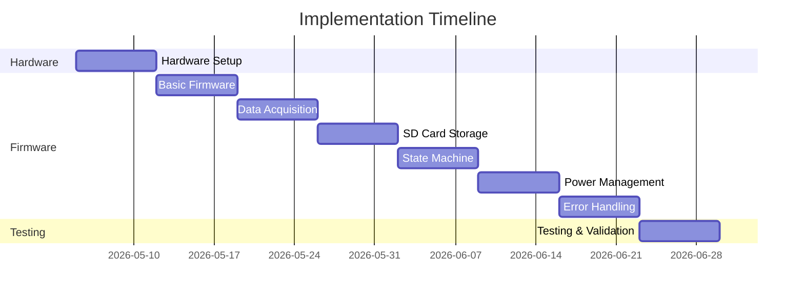

6: Power Management (Week 6)
**Objectives**:
- Implement power states
- Add battery monitoring
- Optimize power consumption

**Tasks**:
- [ ] Implement power state management
- [ ] Add battery voltage monitoring
- [ ] Implement low-power modes
- [ ] Add battery percentage calculation
- [ ] Test power consumption in each state
- [ ] Implement low-battery shutdown
- [ ] Verify battery life
- [ ] Optimize power usage

**Deliverables**:
- Power management module
- Battery monitoring implementation
- Power consumption measurements

#### Phase 7: Error Handling (Week 7)
**Objectives**:
- Implement error detection
- Add recovery mechanisms
- Create error logging

**Tasks**:
- [ ] Implement error classification
- [ ] Add I2C error detection
- [ ] Add SD card error detection
- [ ] Implement retry logic
- [ ] Create error logging system
- [ ] Test error recovery
- [ ] Implement emergency shutdown
- [ ] Document error codes

**Deliverables**:
- Error handling module
- Error recovery mechanisms
- Error log format

#### Phase 8: Testing & Validation (Week 8)
**Objectives**:
- Comprehensive system testing
- Performance validation
- Reliability testing

**Tasks**:
- [ ] Unit test all modules
- [ ] Integration testing
- [ ] Stress testing (8+ hours)
- [ ] Error injection testing
- [ ] Performance profiling
- [ ] Memory usage analysis
- [ ] Power consumption validation
- [ ] Documentation review

**Deliverables**:
- Test results
- Performance metrics
- Validation report

### 12.2 Development Milestones



### 12.3 Risk Management

#### 12.3.1 Technical Risks
| Risk | Probability | Impact | Mitigation |
|------|-------------|--------|------------|
| I2C timing issues | Medium | High | Use proven libraries, add timeout |
| SD write speed insufficient | Low | High | Use buffering, test early |
| Buffer overflow | Medium | Critical | Proper sizing, overflow detection |
| Power consumption too high | Medium | Medium | Early power profiling, optimization |
| Sample rate jitter | Low | Medium | Use hardware timer, verify early |

#### 12.3.2 Hardware Risks
| Risk | Probability | Impact | Mitigation |
|------|-------------|--------|------------|
| Component failure | Low | High | Have spare components |
| Wiring errors | Medium | Medium | Careful assembly, continuity testing |
| Power supply issues | Low | High | Voltage regulation, protection |
| SD card compatibility | Medium | Medium | Test multiple card types |

### 12.4 Development Tools

#### 12.4.1 Software Tools
- **IDE**: Arduino IDE 2.x with Teensy support
- **Libraries**:
  - Wire.h (I2C)
  - SPI.h (SPI)
  - SD.h (SD card)
  - IntervalTimer (Teensy)
- **Version Control**: Git
- **Documentation**: Markdown

#### 12.4.2 Hardware Tools
- **Oscilloscope**: For timing verification
- **Logic Analyzer**: For protocol debugging
- **Multimeter**: For voltage/current measurement
- **Power Supply**: Adjustable 3.3V-5V
- **Breadboard**: For prototyping

#### 12.4.3 Testing Tools
- **Serial Monitor**: Debug output
- **SD Card Reader**: Data verification
- **CSV Viewer**: Data analysis
- **Power Profiler**: Current measurement

---

## 13. Appendices

### Appendix A: Pin Assignment Summary

```
Teensy 3.1 Complete Pin Assignment:

Digital I/O:
  Pin 2  -> SWITCH_OFF (INPUT_PULLUP)
  Pin 3  -> SWITCH_IDLE (INPUT_PULLUP)
  Pin 4  -> SWITCH_LOG (INPUT_PULLUP)
  Pin 5  -> LED_STATUS (OUTPUT)
  Pin 6  -> LED_ERROR (OUTPUT)
  Pin 7  -> LED_LOGGING (OUTPUT)

SPI (SD Card):
  Pin 10 -> SD_CS (OUTPUT)
  Pin 11 -> MOSI (SPI0)
  Pin 12 -> MISO (SPI0)
  Pin 13 -> SCK (SPI0)

I2C (Accelerometer):
  Pin 18 -> SDA (I2C0)
  Pin 19 -> SCL (I2C0)

Analog:
  Pin A0 -> BATTERY_MON (ADC)

Power:
  3.3V   -> All peripherals
  GND    -> Common ground
  VIN    -> Battery input
```

### Appendix B: BMA250 Register Map

```c
// BMA250 I2C Address
#define BMA250_ADDR           0x18

// Register Addresses
#define BMA250_CHIP_ID        0x00  // Should read 0x03
#define BMA250_X_AXIS_LSB     0x02
#define BMA250_X_AXIS_MSB     0x03
#define BMA250_Y_AXIS_LSB     0x04
#define BMA250_Y_AXIS_MSB     0x05
#define BMA250_Z_AXIS_LSB     0x06
#define BMA250_Z_AXIS_MSB     0x07
#define BMA250_TEMP           0x08
#define BMA250_STATUS_REG     0x09
#define BMA250_RANGE          0x0F
#define BMA250_BANDWIDTH      0x10
#define BMA250_POWER_MODE     0x11
#define BMA250_SOFT_RESET     0x14

// Range Settings (Register 0x0F)
#define BMA250_RANGE_2G       0x03  // ±2g
#define BMA250_RANGE_4G       0x05  // ±4g
#define BMA250_RANGE_8G       0x08  // ±8g
#define BMA250_RANGE_16G      0x0C  // ±16g

// Bandwidth Settings (Register 0x10)
#define BMA250_BW_7_81HZ      0x08
#define BMA250_BW_15_63HZ     0x09
#define BMA250_BW_31_25HZ     0x0A
#define BMA250_BW_62_5HZ      0x0B
#define BMA250_BW_125HZ       0x0C
#define BMA250_BW_250HZ       0x0D
#define BMA250_BW_500HZ       0x0E
#define BMA250_BW_1000HZ      0x0F

// Power Mode Settings (Register 0x11)
#define BMA250_MODE_NORMAL    0x00
#define BMA250_MODE_SUSPEND   0x80
```

### Appendix C: CSV File Format Specification

#### C.1 File Header
```csv
# Data Logger - Teensy 3.1 + BMA250
# Firmware Version: 1.0.0
# Start Time: 2026-05-03T10:30:00Z
# Sample Rate: 1000 Hz
# Accelerometer Range: ±2g
# Resolution: 10-bit (1024 LSB/g)
# Battery Voltage: 3.85V
# SD Card: 8GB SanDisk
Timestamp_ms,Accel_X_mg,Accel_Y_mg,Accel_Z_mg
```

#### C.2 Data Format
- **Timestamp_ms**: Milliseconds since logging start (uint32_t)
- **Accel_X_mg**: X-axis acceleration in milligravity (int16_t)
- **Accel_Y_mg**: Y-axis acceleration in milligravity (int16_t)
- **Accel_Z_mg**: Z-axis acceleration in milligravity (int16_t)

#### C.3 Example Data
```csv
0,5,-3,1024
1,8,-5,1020
2,12,-8,1018
3,15,-10,1015
...
```

#### C.4 Conversion Formulas
```c
// Raw to milligravity (mg)
// For ±2g range, 10-bit resolution
int16_t raw_to_mg(int16_t raw) {
    // 1024 LSB/g = 1.024 LSB/mg
    return (raw * 1000) / 1024;
}

// Milligravity to g
float mg_to_g(int16_t mg) {
    return mg / 1000.0;
}

// Milligravity to m/s²
float mg_to_ms2(int16_t mg) {
    return (mg / 1000.0) * 9.81;
}
```

### Appendix D: Error Codes

| Code | Name | Description | Severity | Recovery |
|------|------|-------------|----------|----------|
| 0x00 | ERR_NONE | No error | INFO | - |
| 0x01 | ERR_I2C_TIMEOUT | I2C transaction timeout | ERROR | Retry 3x |
| 0x02 | ERR_I2C_NACK | I2C device not responding | ERROR | Re-init I2C |
| 0x03 | ERR_ACCEL_INIT | Accelerometer init failed | CRITICAL | Manual reset |
| 0x04 | ERR_SD_INIT | SD card init failed | CRITICAL | Check card |
| 0x05 | ERR_SD_WRITE | SD write failed | ERROR | Retry 3x |
| 0x06 | ERR_SD_FULL | SD card full | WARNING | Stop logging |
| 0x07 | ERR_BUFFER_OVERFLOW | Data buffer overflow | ERROR | Increase buffer |
| 0x08 | ERR_BATTERY_LOW | Battery voltage low | WARNING | Continue |
| 0x09 | ERR_BATTERY_CRITICAL | Battery critically low | CRITICAL | Shutdown |
| 0x0A | ERR_FILE_CREATE | Cannot create file | ERROR | Retry |
| 0x0B | ERR_FILE_CLOSE | Cannot close file | WARNING | Force close |
| 0x0C | ERR_TIMESTAMP | Timestamp overflow | WARNING | Reset timer |

### Appendix E: Memory Map

```
Teensy 3.1 (MK20DX256) Memory Layout:

Flash (256KB):
0x00000000 - 0x00000400  Vector Table (1KB)
0x00000400 - 0x0000A000  Application Code (~40KB)
0x0000A000 - 0x00040000  Unused (~216KB)

RAM (64KB):
0x1FFF8000 - 0x1FFF8800  Stack (2KB)
0x1FFF8800 - 0x1FFFC000  Heap (14KB)
0x1FFFC000 - 0x20000000  Data Buffers (16KB)
0x20000000 - 0x20008000  Static Data (32KB)

Data Buffer Allocation:
- Circular Buffer: 32KB (5461 samples × 10 bytes)
- SD Write Buffer: 4KB
- I2C/SPI Buffers: 2KB
- Error Log Buffer: 1KB
- Reserved: 1KB
```

### Appendix F: Power Consumption Analysis

#### F.1 Component Power Draw
```
Component Power Analysis:

Teensy 3.1:
- Active (48MHz): 20mA
- Idle (24MHz): 10mA
- Sleep: 5mA

BMA250:
- Normal mode: 0.13mA
- Low power: 0.05mA
- Suspend: 0.002mA

SD Card:
- Write: 80-100mA
- Read: 40-60mA
- Idle: 2-5mA
- Sleep: <1mA

LEDs (3x @ 5mA each):
- All on: 15mA
- Status only: 5mA
- All off: 0mA

Total Power Budget:
- Logging (worst case): 135mA
- Logging (typical): 120mA
- Idle: 7mA
- Off: <1mA
```

#### F.2 Battery Life Calculation
```
Battery: 2000mAh LiPo 3.7V

Continuous Logging:
- Current: 120mA (average)
- Runtime: 2000mAh / 120mA = 16.7 hours
- With efficiency (80%): 13.3 hours

Mixed Usage (50% logging, 50% idle):
- Average current: (120mA + 7mA) / 2 = 63.5mA
- Runtime: 2000mAh / 63.5mA = 31.5 hours
- With efficiency (80%): 25.2 hours

Idle Only:
- Current: 7mA
- Runtime: 2000mAh / 7mA = 285 hours
- With efficiency (80%): 228 hours (9.5 days)
```

### Appendix G: Performance Benchmarks

#### G.1 Timing Benchmarks
```
Operation Timing (measured):

I2C Read (6 bytes):
- Best case: 140μs
- Average: 150μs
- Worst case: 180μs

SD Write (512 bytes):
- Best case: 2ms
- Average: 5ms
- Worst case: 15ms

Buffer Write:
- Best case: 15μs
- Average: 20μs
- Worst case: 30μs

ISR Execution:
- Best case: 200μs
- Average: 250μs
- Worst case: 300μs
```

#### G.2 Throughput Benchmarks
```
Data Throughput:

Sample Rate: 1000 Hz
Sample Size: 10 bytes (binary)
CSV Size: ~40 bytes (formatted)

Data Rate:
- Binary: 10 KB/s
- CSV: 40 KB/s

SD Write Performance:
- Sequential write: 100-200 KB/s
- Random write: 50-100 KB/s
- Sustained write: 80 KB/s (minimum)

Buffer Capacity:
- Size: 5461 samples
- Duration: 5.461 seconds
- Margin: 5.4x real-time
```

### Appendix H: Bill of Materials (BOM)

| Item | Part Number | Quantity | Unit Price | Total | Supplier |
|------|-------------|----------|------------|-------|----------|
| Teensy 3.1 | TEENSY31 | 1 | $19.80 | $19.80 | PJRC |
| BMA250 Accelerometer | ASD2611 | 1 | $9.95 | $9.95 | TinyCircuits |
| SD Card Module | 4682 | 1 | $7.50 | $7.50 | Adafruit |
| Tri-way Switch | - | 1 | $2.00 | $2.00 | Generic |
| LEDs (Red/Green/Blue) | - | 3 | $0.50 | $1.50 | Generic |
| Resistors (220Ω) | - | 3 | $0.10 | $0.30 | Generic |
| Resistors (10kΩ) | - | 2 | $0.10 | $0.20 | Generic |
| LiPo Battery 2000mAh | - | 1 | $12.00 | $12.00 | Generic |
| SD Card 8GB | - | 1 | $8.00 | $8.00 | Generic |
| Breadboard | - | 1 | $5.00 | $5.00 | Generic |
| Jumper Wires | - | 1 set | $3.00 | $3.00 | Generic |
| **Total** | | | | **$69.25** | |

### Appendix I: References

#### I.1 Datasheets
1. **Teensy 3.1**: https://www.pjrc.com/teensy/3.1.html
2. **MK20DX256**: https://www.nxp.com/docs/en/data-sheet/K20P64M72SF1.pdf
3. **BMA250**: https://www.bosch-sensortec.com/media/boschsensortec/downloads/datasheets/bst-bma250-ds004.pdf
4. **SD Card Spec**: https://www.sdcard.org/downloads/pls/

#### I.2 Libraries
1. **Arduino Wire**: https://www.arduino.cc/en/Reference/Wire
2. **Arduino SPI**: https://www.arduino.cc/en/Reference/SPI
3. **Arduino SD**: https://www.arduino.cc/en/Reference/SD
4. **Teensy IntervalTimer**: https://www.pjrc.com/teensy/td_timing_IntervalTimer.html

#### I.3 Application Notes
1. **I2C Bus Specification**: NXP UM10204
2. **SD Card Physical Layer**: SD Association
3. **Low Power Design**: ARM AN209
4. **Accelerometer Applications**: Bosch BST-MMA150-AN004

---

## Document Revision History

| Version | Date | Author | Changes |
|---------|------|--------|---------|
| 1.0 | 2026-05-03 | Bob (Plan Mode) | Initial FSD creation |

---

## Approval Signatures

| Role | Name | Signature | Date |
|------|------|-----------|------|
| Project Lead | | | |
| Hardware Engineer | | | |
| Software Engineer | | | |
| Test Engineer | | | |

---

**END OF DOCUMENT**