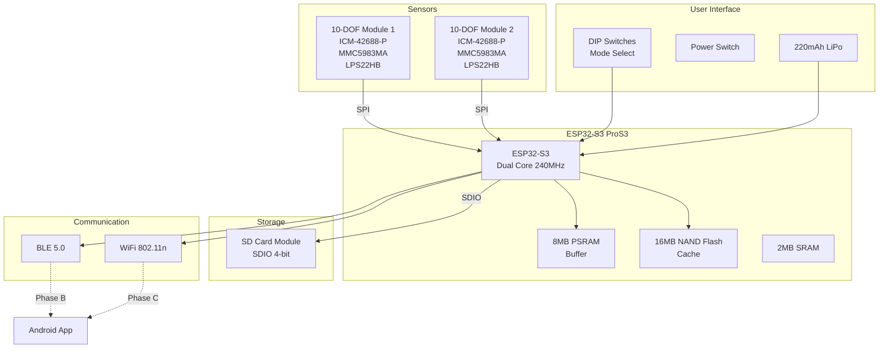
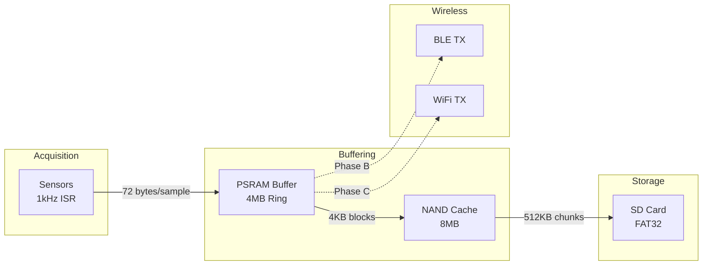
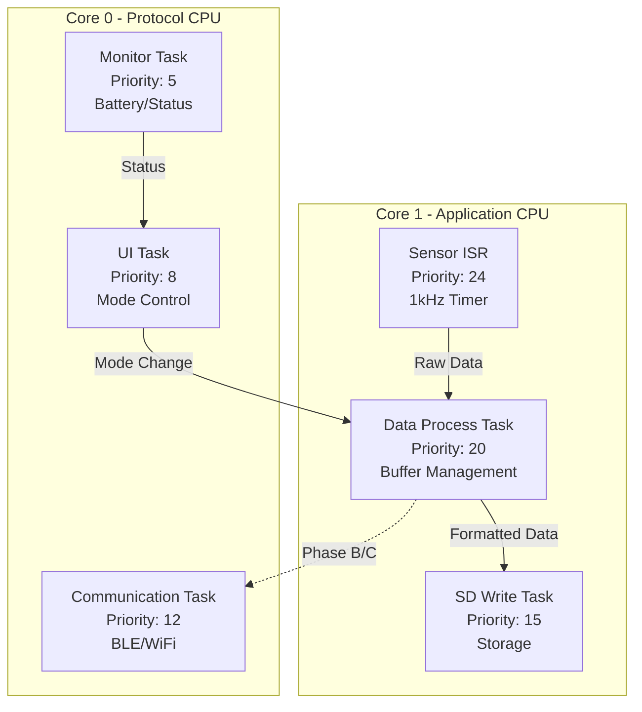
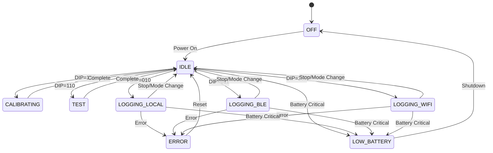
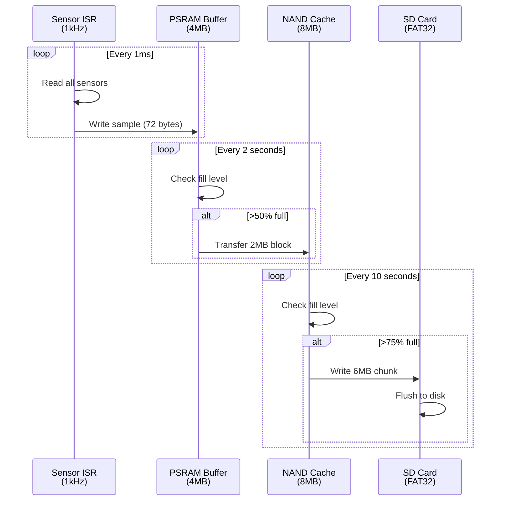
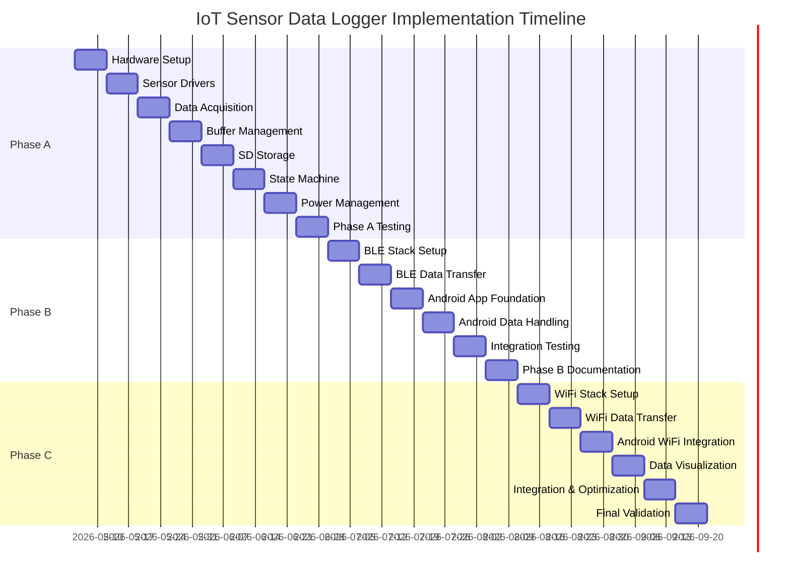

# Functional Specification Document (FSD)
# Multi-Phase IoT Sensor Data Logger System
# ESP32-S3 Based 10-DOF Sensor Platform

**Project Name**: IoT Multi-Sensor Data Logger with Wireless Communication  
**Hardware Platform**: Unexpected Maker ProS3 (ESP32-S3)  
**Document Version**: 1.0  
**Date**: 2026-05-03  
**Author**: Bob (Advanced Mode)  
**Status**: Draft

---

## Table of Contents

1. [Executive Summary](#1-executive-summary)
2. [Project Overview](#2-project-overview)
3. [System Architecture](#3-system-architecture)
4. [Hardware Specifications](#4-hardware-specifications)
5. [Software Architecture](#5-software-architecture)
6. [Phase A: Local SD Card Storage](#6-phase-a-local-sd-card-storage)
7. [Phase B: BLE Communication](#7-phase-b-ble-communication)
8. [Phase C: WiFi Communication & Visualization](#8-phase-c-wifi-communication--visualization)
9. [Data Management](#9-data-management)
10. [Power Management](#10-power-management)
11. [Requirements Traceability Matrix](#11-requirements-traceability-matrix)
12. [Test Specifications](#12-test-specifications)
13. [Implementation Plan](#13-implementation-plan)
14. [Risk Management](#14-risk-management)
15. [Appendices](#15-appendices)

---

## 1. Executive Summary

### 1.1 Project Purpose
This project implements a high-performance IoT sensor data logger using the ESP32-S3 microcontroller with dual 10-DOF sensor modules. The system captures accelerometer, gyroscope, magnetometer, and pressure sensor data at high sampling rates, stores data locally on SD card, and provides wireless communication capabilities via BLE and WiFi.

### 1.2 Key Features
- **Dual 10-DOF Sensor Modules**: ICM-42688-P (accel/gyro), MMC5983MA (magnetometer), LPS22HB (pressure)
- **High-Speed Data Acquisition**: Up to 1kHz sampling rate per sensor
- **Multi-Tier Storage**: PSRAM buffering → NAND flash caching → SD card storage
- **Three Development Phases**:
  - Phase A: Local SD card storage with DIP switch control
  - Phase B: BLE communication to Android app
  - Phase C: WiFi communication with real-time visualization
- **Battery Powered**: 220mAh LiPo with USB charging and monitoring
- **Real-Time OS**: FreeRTOS for task management and timing precision

### 1.3 Target Applications
- Motion capture and analysis
- Vibration monitoring
- Orientation tracking
- Environmental data logging
- IoT sensor networks
- Research and development

---

## 2. Project Overview

### 2.1 System Goals
1. **High-Performance Data Acquisition**: Capture sensor data at 1kHz with minimal jitter
2. **Reliable Data Storage**: Multi-tier buffering to prevent data loss
3. **Flexible Communication**: Support both BLE and WiFi protocols
4. **Low Power Operation**: Optimize for battery life in portable applications
5. **User-Friendly Interface**: Simple mode selection and status indication
6. **Scalable Architecture**: Modular design for future enhancements

### 2.2 Project Phases

#### Phase A: Local Storage (Weeks 1-8)
- Hardware assembly and testing
- Sensor driver development
- SD card storage implementation
- DIP switch mode control
- Battery monitoring
- CSV data format

**Deliverables**:
- Functional hardware prototype
- Working firmware with local storage
- Test results and validation report

#### Phase B: BLE Communication (Weeks 9-14)
- BLE stack integration
- Android app development (Android 5.0.1+ compatible)
- Wireless data transfer
- Remote start/stop control
- App-based data storage

**Deliverables**:
- BLE-enabled firmware
- Android application (APK)
- BLE communication protocol documentation

#### Phase C: WiFi & Visualization (Weeks 15-20)
- WiFi stack integration
- Real-time data visualization
- WiFi Direct/AP mode
- Enhanced Android app with charts
- Performance optimization

**Deliverables**:
- WiFi-enabled firmware
- Enhanced Android app with visualization
- Complete system documentation

### 2.3 Success Criteria
- [ ] Achieve 1kHz sampling rate with <1% jitter
- [ ] Zero data loss during continuous 8-hour operation
- [ ] Battery life >6 hours continuous logging
- [ ] BLE range >10 meters
- [ ] WiFi throughput >100KB/s
- [ ] Android app compatible with Android 5.0.1+
- [ ] SD card write speed >500KB/s sustained

---

## 3. System Architecture

### 3.1 High-Level Architecture



### 3.2 Data Flow Architecture



### 3.3 Software Architecture Layers

```
┌─────────────────────────────────────────────────┐
│         Application Layer                       │
│  - State Machine                                │
│  - Mode Control                                 │
│  - User Interface                               │
└─────────────────────────────────────────────────┘
┌─────────────────────────────────────────────────┐
│         Communication Layer (Phase B/C)         │
│  - BLE Service                                  │
│  - WiFi Service                                 │
│  - Protocol Handlers                            │
└─────────────────────────────────────────────────┘
┌─────────────────────────────────────────────────┐
│         Data Management Layer                   │
│  - Buffer Manager                               │
│  - Storage Manager                              │
│  - Data Formatter                               │
└─────────────────────────────────────────────────┘
┌─────────────────────────────────────────────────┐
│         Hardware Abstraction Layer              │
│  - Sensor Drivers (ICM/MMC/LPS)                │
│  - SD Card Driver                               │
│  - GPIO/SPI/SDIO                                │
└─────────────────────────────────────────────────┘
┌─────────────────────────────────────────────────┐
│         FreeRTOS / ESP-IDF                      │
│  - Task Scheduler                               │
│  - Timers & Interrupts                          │
│  - Memory Management                            │
└─────────────────────────────────────────────────┘
```

---

## 4. Hardware Specifications

### 4.1 Main Controller

#### 4.1.1 Unexpected Maker ProS3 Specifications
- **Microcontroller**: ESP32-S3-WROOM-1-N16R8
- **CPU**: Xtensa dual-core 32-bit LX7, up to 240MHz
- **Memory**:
  - 2MB SRAM (internal)
  - 8MB PSRAM (external)
  - 16MB NAND Flash (external)
- **Wireless**:
  - WiFi 802.11 b/g/n (2.4GHz)
  - BLE 5.0
- **USB**: Native USB-OTG (USB-C)
- **Power**: 3.3V regulated, LiPo charging circuit
- **Dimensions**: 25.4mm × 58mm
- **Documentation**: 
  - https://esp32s3.com/pros3d.html
  - https://github.com/UnexpectedMaker/esp32s3/tree/main/series_d

### 4.2 Sensor Modules

#### 4.2.1 ICM-42688-P (Accelerometer/Gyroscope)
**Specifications**:
- **Type**: 6-axis IMU (3-axis accel + 3-axis gyro)
- **Interface**: SPI (up to 24MHz)
- **Accelerometer**:
  - Range: ±2g, ±4g, ±8g, ±16g (selectable)
  - Resolution: 16-bit
  - Noise: 70 μg/√Hz
  - ODR: 1.5625Hz to 8kHz
- **Gyroscope**:
  - Range: ±250, ±500, ±1000, ±2000 dps (selectable)
  - Resolution: 16-bit
  - Noise: 0.004 dps/√Hz
  - ODR: 12.5Hz to 8kHz
- **FIFO**: 2KB
- **Power**: 1.2mA (accel+gyro active)
- **Documentation**:
  - https://invensense.tdk.com/download-resource/ds-000347-icm-42688-p-datasheet
  - https://invensense.tdk.com/download-resource/ug-icm-42688-p-software-user-guide-icm-42688-p

#### 4.2.2 MMC5983MA (Magnetometer)
**Specifications**:
- **Type**: 3-axis magnetometer
- **Interface**: SPI (up to 10MHz)
- **Range**: ±8 Gauss
- **Resolution**: 18-bit (0.0625 mG/LSB)
- **Noise**: 0.4 mG RMS
- **ODR**: Up to 1000Hz
- **Power**: 2.0mA (active)
- **Documentation**:
  - https://www.memsic.com/magnetometer-5
  - https://www.memsic.com/Public/Uploads/uploadfile/files/20220119/MMC5983MADatasheetRevA.pdf

#### 4.2.3 LPS22HB (Pressure Sensor)
**Specifications**:
- **Type**: Absolute pressure sensor
- **Interface**: SPI (up to 10MHz)
- **Range**: 260-1260 hPa
- **Resolution**: 24-bit (0.0002 hPa)
- **Accuracy**: ±0.1 hPa
- **ODR**: 1Hz to 75Hz
- **Power**: 3μA @ 1Hz
- **Documentation**:
  - https://www.st.com/en/mems-and-sensors/lps22hb.html
  - https://www.st.com/resource/en/datasheet/lps22hb.pdf
  - https://github.com/STMicroelectronics/stm32-lps22hb

### 4.3 Storage Module

#### 4.3.1 SD Card Module
- **Interface**: SDIO 4-bit mode (up to 50MHz)
- **Supported Cards**: SDHC/SDXC (up to 2TB)
- **File System**: FAT32 / exFAT
- **Write Speed**: >10MB/s (Class 10 card)
- **Power**: 80-100mA (write), 2-5mA (idle)
- **Documentation**: https://www.adafruit.com/product/4682

### 4.4 User Interface

#### 4.4.1 DIP Switches (Mode Selection)
- **Type**: ALCOSWITCH ADEN03TTU04
- **Configuration**: 3-position (8 possible states)
- **Voltage**: 3.3V logic
- **Current**: <1mA per switch
- **Documentation**: https://www.te.com/en/product-2454982-2.html

**Mode Mapping**:
```
SW1 SW2 SW3 | Mode
----|----|----|------------------
 0   0   0  | OFF (deep sleep)
 0   0   1  | IDLE (standby)
 0   1   0  | LOG_LOCAL (Phase A)
 0   1   1  | LOG_BLE (Phase B)
 1   0   0  | LOG_WIFI (Phase C)
 1   0   1  | CALIBRATE
 1   1   0  | TEST
 1   1   1  | RESERVED
```

#### 4.4.2 Power Switch
- **Type**: SPST mechanical switch
- **Rating**: 3A @ 3.7V
- **Function**: Battery disconnect

### 4.5 Power System

#### 4.5.1 Battery
- **Type**: LiPo single cell
- **Capacity**: 220mAh
- **Voltage**: 3.7V nominal (4.2V max, 3.0V min)
- **Connector**: JST-PH 2.0mm
- **Protection**: Built-in PCM

#### 4.5.2 Power Budget
```
Component Power Analysis:

ESP32-S3:
- Active (240MHz, WiFi): 160-260mA
- Active (240MHz, BLE): 95-140mA
- Active (240MHz, no RF): 40-50mA
- Light sleep: 0.8mA
- Deep sleep: 10μA

Sensors (2× modules):
- ICM-42688-P: 2× 1.2mA = 2.4mA
- MMC5983MA: 2× 2.0mA = 4.0mA
- LPS22HB: 2× 0.003mA = 0.006mA
- Total sensors: ~6.4mA

SD Card:
- Write: 80-100mA
- Idle: 2-5mA

Total Power Budget:
- Logging (WiFi): 260 + 6.4 + 90 = 356mA (worst case)
- Logging (BLE): 140 + 6.4 + 90 = 236mA
- Logging (local): 50 + 6.4 + 90 = 146mA
- Idle: 0.8 + 0.006 + 3 = 3.8mA
- Deep sleep: 0.01 + 0 + 0 = 0.01mA

Battery Life Estimates (220mAh):
- WiFi logging: 220/356 = 0.62 hours (37 min)
- BLE logging: 220/236 = 0.93 hours (56 min)
- Local logging: 220/146 = 1.5 hours (90 min)
- Idle: 220/3.8 = 58 hours (2.4 days)
```

### 4.6 Pin Assignment

#### 4.6.1 ESP32-S3 ProS3 Pin Mapping

```
Pin Assignment Table:

GPIO | Function        | Direction | Description
-----|-----------------|-----------|---------------------------
 1   | SENSOR1_CS      | OUTPUT    | ICM-42688-P #1 Chip Select
 2   | SENSOR2_CS      | OUTPUT    | ICM-42688-P #2 Chip Select
 3   | MAG1_CS         | OUTPUT    | MMC5983MA #1 Chip Select
 4   | MAG2_CS         | OUTPUT    | MMC5983MA #2 Chip Select
 5   | PRESS1_CS       | OUTPUT    | LPS22HB #1 Chip Select
 6   | PRESS2_CS       | OUTPUT    | LPS22HB #2 Chip Select
 7   | DIP_SW1         | INPUT_PU  | Mode select bit 0
 8   | DIP_SW2         | INPUT_PU  | Mode select bit 1
 9   | DIP_SW3         | INPUT_PU  | Mode select bit 2
10   | BATTERY_ADC     | ANALOG    | Battery voltage monitor
11   | STATUS_LED      | OUTPUT    | Status indicator (RGB)
12   | SD_D0           | SDIO      | SD card data 0
13   | SD_D1           | SDIO      | SD card data 1
14   | SD_D2           | SDIO      | SD card data 2
15   | SD_D3           | SDIO      | SD card data 3
16   | SD_CLK          | SDIO      | SD card clock
17   | SD_CMD          | SDIO      | SD card command
35   | SPI_MOSI        | SPI       | Sensor SPI MOSI
36   | SPI_MISO        | SPI       | Sensor SPI MISO
37   | SPI_CLK         | SPI       | Sensor SPI clock (20MHz)

USB  | USB_D+/D-       | USB       | Native USB (programming/charging)
```

#### 4.6.2 SDIO Configuration
**Rationale for SDIO 4-bit mode**:
- Maximum throughput: 50MB/s theoretical, 10-20MB/s practical
- Dedicated pins (no sharing with SPI bus)
- Hardware CRC checking
- DMA support for efficient transfers
- Lower CPU overhead vs SPI mode

**Alternative considered**: SPI mode (1-bit) would limit speed to ~2MB/s

#### 4.6.3 SPI Bus Configuration
- **Clock Speed**: 20MHz (safe for all sensors)
- **Mode**: SPI Mode 0 (CPOL=0, CPHA=0) for ICM-42688-P
- **Mode**: SPI Mode 3 (CPOL=1, CPHA=1) for MMC5983MA
- **Bit Order**: MSB first
- **CS Control**: Software controlled, active low


### 4.7 Hardware Block Diagram

```
                    ┌─────────────────────────────────────┐
                    │   Unexpected Maker ProS3            │
                    │   ESP32-S3-WROOM-1-N16R8           │
                    │                                     │
                    │  ┌──────────────────────────────┐  │
                    │  │  Dual Core Xtensa LX7        │  │
                    │  │  240MHz                      │  │
                    │  └──────────────────────────────┘  │
                    │                                     │
                    │  ┌────────┐  ┌────────┐           │
                    │  │ 2MB    │  │ 8MB    │           │
                    │  │ SRAM   │  │ PSRAM  │           │
                    │  └────────┘  └────────┘           │
                    │                                     │
                    │  ┌──────────────────────────────┐  │
                    │  │  16MB NAND Flash             │  │
                    │  └──────────────────────────────┘  │
                    └─────────────────────────────────────┘
                              │     │     │
        ┌─────────────────────┼─────┼─────┼─────────────────────┐
        │                     │     │     │                     │
        │ SPI Bus (20MHz)     │     │     │  SDIO 4-bit (50MHz)│
        │                     │     │     │                     │
   ┌────▼────┐           ┌────▼────┐     │                ┌────▼────┐
   │10-DOF #1│           │10-DOF #2│     │                │SD Card  │
   │         │           │         │     │                │Module   │
   │ICM-42688│           │ICM-42688│     │                │         │
   │MMC5983MA│           │MMC5983MA│     │                │FAT32    │
   │LPS22HB  │           │LPS22HB  │     │                │         │
   └─────────┘           └─────────┘     │                └─────────┘
                                          │
                    ┌─────────────────────┼─────────────────────┐
                    │                     │                     │
               ┌────▼────┐           ┌────▼────┐          ┌────▼────┐
               │DIP      │           │Battery  │          │Power    │
               │Switches │           │220mAh   │          │Switch   │
               │(Mode)   │           │LiPo     │          │         │
               └─────────┘           └─────────┘          └─────────┘
```

---

## 5. Software Architecture

### 5.1 Development Environment

#### 5.1.1 Toolchain
- **Framework**: ESP-IDF v5.1+
- **Language**: C/C++ (C11/C++17)
- **RTOS**: FreeRTOS (included in ESP-IDF)
- **Build System**: CMake
- **IDE**: VS Code with ESP-IDF extension
- **Version Control**: Git

#### 5.1.2 Key Libraries
```c
// ESP-IDF Components
#include "freertos/FreeRTOS.h"
#include "freertos/task.h"
#include "freertos/queue.h"
#include "freertos/semphr.h"
#include "driver/spi_master.h"
#include "driver/sdmmc_host.h"
#include "driver/gpio.h"
#include "driver/adc.h"
#include "esp_timer.h"
#include "esp_log.h"
#include "nvs_flash.h"

// Phase B additions
#include "esp_bt.h"
#include "esp_gap_ble_api.h"
#include "esp_gatts_api.h"

// Phase C additions
#include "esp_wifi.h"
#include "esp_event.h"
#include "lwip/sockets.h"
```

### 5.2 Task Architecture

#### 5.2.1 FreeRTOS Task Structure

```c
// Task Priorities (0 = lowest, 24 = highest)
#define TASK_PRIORITY_SENSOR_ISR    24  // Highest - time critical
#define TASK_PRIORITY_DATA_PROCESS  20  // High - data processing
#define TASK_PRIORITY_SD_WRITE      15  // Medium-high - storage
#define TASK_PRIORITY_COMM          12  // Medium - BLE/WiFi
#define TASK_PRIORITY_UI            8   // Medium-low - user interface
#define TASK_PRIORITY_MONITOR       5   // Low - battery/status
#define TASK_PRIORITY_IDLE          1   // Lowest - background

// Task Stack Sizes
#define STACK_SIZE_SENSOR    4096
#define STACK_SIZE_DATA      8192
#define STACK_SIZE_SD        4096
#define STACK_SIZE_COMM      8192
#define STACK_SIZE_UI        2048
#define STACK_SIZE_MONITOR   2048
```

#### 5.2.2 Task Diagram



### 5.3 Data Structures

#### 5.3.1 Sensor Data Structure

```c
// Single sensor sample (all sensors, one module)
typedef struct {
    uint32_t timestamp_us;      // Microsecond timestamp
    
    // ICM-42688-P (Accel + Gyro)
    int16_t accel_x_raw;        // Raw accelerometer X
    int16_t accel_y_raw;        // Raw accelerometer Y
    int16_t accel_z_raw;        // Raw accelerometer Z
    int16_t gyro_x_raw;         // Raw gyroscope X
    int16_t gyro_y_raw;         // Raw gyroscope Y
    int16_t gyro_z_raw;         // Raw gyroscope Z
    
    // MMC5983MA (Magnetometer)
    int32_t mag_x_raw;          // Raw magnetometer X (18-bit)
    int32_t mag_y_raw;          // Raw magnetometer Y (18-bit)
    int32_t mag_z_raw;          // Raw magnetometer Z (18-bit)
    
    // LPS22HB (Pressure)
    int32_t pressure_raw;       // Raw pressure (24-bit)
    int16_t temperature_raw;    // Raw temperature (16-bit)
    
    uint8_t module_id;          // 0 or 1 (which sensor module)
    uint8_t status;             // Status flags
} __attribute__((packed)) sensor_sample_t;

// Size: 4 + 12 + 12 + 6 + 2 = 36 bytes per module
// Total: 72 bytes for both modules per sample

// Converted/calibrated data
typedef struct {
    uint32_t timestamp_us;
    
    // Accelerometer (m/s²)
    float accel_x_ms2;
    float accel_y_ms2;
    float accel_z_ms2;
    
    // Gyroscope (rad/s)
    float gyro_x_rads;
    float gyro_y_rads;
    float gyro_z_rads;
    
    // Magnetometer (μT)
    float mag_x_ut;
    float mag_y_ut;
    float mag_z_ut;
    
    // Pressure (hPa) and Temperature (°C)
    float pressure_hpa;
    float temperature_c;
    
    uint8_t module_id;
    uint8_t quality;            // Data quality indicator
} sensor_data_t;

// Size: 4 + 40 + 2 = 46 bytes per module
```

#### 5.3.2 Buffer Structures

```c
// PSRAM Ring Buffer Configuration
#define PSRAM_BUFFER_SIZE       (4 * 1024 * 1024)  // 4MB
#define SAMPLES_PER_BUFFER      (PSRAM_BUFFER_SIZE / sizeof(sensor_sample_t))
// = 4MB / 72 bytes = ~58,254 samples = ~58 seconds @ 1kHz

typedef struct {
    sensor_sample_t* buffer;    // Pointer to PSRAM
    uint32_t write_index;       // Current write position
    uint32_t read_index;        // Current read position
    uint32_t sample_count;      // Number of samples in buffer
    SemaphoreHandle_t mutex;    // Thread safety
    bool overflow;              // Overflow flag
} psram_buffer_t;

// NAND Flash Cache Configuration
#define FLASH_CACHE_SIZE        (8 * 1024 * 1024)  // 8MB
#define FLASH_BLOCK_SIZE        (4 * 1024)         // 4KB blocks

typedef struct {
    uint32_t start_address;     // Flash partition start
    uint32_t write_offset;      // Current write position
    uint32_t read_offset;       // Current read position
    uint32_t used_bytes;        // Bytes currently used
    bool cache_full;            // Full flag
} flash_cache_t;

// SD Card Write Buffer
#define SD_WRITE_BUFFER_SIZE    (512 * 1024)       // 512KB
#define SD_WRITE_THRESHOLD      (256 * 1024)       // Write when 256KB full

typedef struct {
    uint8_t* buffer;            // Write buffer
    uint32_t bytes_used;        // Current fill level
    FILE* file_handle;          // Open file handle
    char filename[64];          // Current filename
    uint64_t total_bytes;       // Total bytes written
} sd_buffer_t;
```

### 5.4 State Machine

#### 5.4.1 System States

```c
typedef enum {
    STATE_OFF,              // Deep sleep, minimal power
    STATE_IDLE,             // Standby, ready to start
    STATE_CALIBRATING,      // Sensor calibration mode
    STATE_LOGGING_LOCAL,    // Phase A: Local SD logging
    STATE_LOGGING_BLE,      // Phase B: BLE transmission
    STATE_LOGGING_WIFI,     // Phase C: WiFi transmission
    STATE_TEST,             // Self-test mode
    STATE_ERROR,            // Error state
    STATE_LOW_BATTERY       // Low battery shutdown
} system_state_t;

typedef enum {
    EVENT_MODE_CHANGE,      // DIP switch changed
    EVENT_START_LOG,        // Start logging command
    EVENT_STOP_LOG,         // Stop logging command
    EVENT_BUFFER_FULL,      // Buffer overflow imminent
    EVENT_SD_FULL,          // SD card full
    EVENT_BATTERY_LOW,      // Battery below threshold
    EVENT_ERROR,            // Error occurred
    EVENT_CALIBRATE,        // Calibration request
    EVENT_TEST              // Test mode request
} system_event_t;
```

#### 5.4.2 State Transition Diagram



### 5.5 Memory Management

#### 5.5.1 Memory Allocation Strategy

```c
// Memory Regions
// SRAM (2MB): Stack, heap, static data
// PSRAM (8MB): Large buffers, data cache
// Flash (16MB): Code, constants, NAND cache

// PSRAM Allocation
#define PSRAM_SENSOR_BUFFER     (4 * 1024 * 1024)  // 4MB ring buffer
#define PSRAM_COMM_BUFFER       (2 * 1024 * 1024)  // 2MB comm buffer
#define PSRAM_RESERVED          (2 * 1024 * 1024)  // 2MB reserved

// SRAM Allocation
#define SRAM_TASK_STACKS        (32 * 1024)        // 32KB total
#define SRAM_HEAP               (512 * 1024)       // 512KB heap
#define SRAM_STATIC             (256 * 1024)       // 256KB static

// Flash Partition Table
// 0x0000000 - 0x0010000: Bootloader (64KB)
// 0x0010000 - 0x0020000: Partition table (64KB)
// 0x0020000 - 0x0030000: NVS (64KB)
// 0x0030000 - 0x0400000: Application (3.8MB)
// 0x0400000 - 0x0C00000: Data cache (8MB)
// 0x0C00000 - 0x1000000: Reserved (4MB)
```

#### 5.5.2 Buffer Management Strategy

```
Data Flow with Multi-Tier Buffering:

Sensors (1kHz) → PSRAM Ring Buffer (4MB, ~58s)
                      ↓
                 NAND Flash Cache (8MB, ~116s)
                      ↓
                 SD Card (unlimited)

Overflow Protection:
1. PSRAM fills → trigger NAND write
2. NAND fills → trigger SD write
3. SD write fails → stop acquisition, set error flag
4. Monitor fill levels continuously

Write Strategy:
- PSRAM → NAND: When 50% full (2MB)
- NAND → SD: When 75% full (6MB)
- Emergency flush: When 90% full
```

---

## 6. Phase A: Local SD Card Storage

### 6.1 Phase A Overview

**Duration**: Weeks 1-8  
**Goal**: Implement complete local data logging system with SD card storage

### 6.2 Phase A Requirements

#### 6.2.1 Functional Requirements

| ID | Requirement | Priority | Verification |
|----|-------------|----------|--------------|
| A-FR-001 | System shall acquire data from both 10-DOF modules at 1kHz | CRITICAL | Test |
| A-FR-002 | System shall buffer data in PSRAM (4MB ring buffer) | CRITICAL | Test |
| A-FR-003 | System shall cache data in NAND flash (8MB) | HIGH | Test |
| A-FR-004 | System shall write data to SD card in CSV format | CRITICAL | Test |
| A-FR-005 | System shall support DIP switch mode selection | HIGH | Test |
| A-FR-006 | System shall monitor battery voltage | HIGH | Test |
| A-FR-007 | System shall generate timestamped filenames | MEDIUM | Test |
| A-FR-008 | System shall prevent data loss during buffer overflow | CRITICAL | Test |
| A-FR-009 | System shall indicate status via LED | MEDIUM | Demo |
| A-FR-010 | System shall handle SD card errors gracefully | HIGH | Test |

#### 6.2.2 Performance Requirements

| ID | Requirement | Target | Verification |
|----|-------------|--------|--------------|
| A-PR-001 | Sample rate accuracy | ±1% | Oscilloscope |
| A-PR-002 | Sample rate jitter | <100μs | Logic analyzer |
| A-PR-003 | SD write speed | >500KB/s sustained | Benchmark |
| A-PR-004 | Buffer overflow prevention | 0 lost samples in 8hr | Stress test |
| A-PR-005 | Boot time | <5 seconds | Stopwatch |
| A-PR-006 | Mode switch response | <500ms | Test |
| A-PR-007 | Battery life (local logging) | >90 minutes | Test |
| A-PR-008 | CPU utilization | <80% average | Profiler |

### 6.3 Phase A Architecture

#### 6.3.1 Software Modules

```c
// Module: sensor_driver.c/h
// - ICM-42688-P driver (SPI)
// - MMC5983MA driver (SPI)
// - LPS22HB driver (SPI)
// - Sensor initialization
// - Data acquisition ISR
// - Calibration routines

// Module: buffer_manager.c/h
// - PSRAM ring buffer management
// - NAND flash cache management
// - Buffer overflow detection
// - Thread-safe access

// Module: sd_storage.c/h
// - SDIO initialization
// - FAT32 file system
// - CSV file creation
// - Buffered writes
// - Error handling

// Module: state_machine.c/h
// - State management
// - Event handling
// - Mode transitions
// - DIP switch monitoring

// Module: power_manager.c/h
// - Battery voltage monitoring
// - Low battery detection
// - Power state management
// - Charging status

// Module: ui_manager.c/h
// - LED status indication
// - DIP switch reading
// - User feedback
```

#### 6.3.2 Data Flow (Phase A)



### 6.4 Phase A CSV File Format

#### 6.4.1 File Naming Convention
```
Format: YYYYMMDD_HHMMSS_MOD.csv
Example: 20260503_143022_M1.csv (Module 1)
         20260503_143022_M2.csv (Module 2)

Separate files for each module to avoid interleaving issues
```

#### 6.4.2 CSV Header
```csv
# IoT Sensor Data Logger - Phase A
# Hardware: Unexpected Maker ProS3 (ESP32-S3)
# Firmware Version: 1.0.0
# Module ID: 1
# Start Time: 2026-05-03T14:30:22Z
# Sample Rate: 1000 Hz
# Sensors: ICM-42688-P, MMC5983MA, LPS22HB
# Accelerometer Range: ±16g
# Gyroscope Range: ±2000dps
# Magnetometer Range: ±8G
# Pressure Range: 260-1260hPa
# Battery Voltage: 3.85V
# SD Card: 32GB SanDisk Ultra
Timestamp_us,Accel_X_mg,Accel_Y_mg,Accel_Z_mg,Gyro_X_mdps,Gyro_Y_mdps,Gyro_Z_mdps,Mag_X_uT,Mag_Y_uT,Mag_Z_uT,Pressure_hPa,Temp_C
```

#### 6.4.3 Data Format
```csv
0,5,-3,1024,12,-8,5,45.2,-12.3,38.7,1013.25,22.5
1000,8,-5,1020,15,-10,8,45.3,-12.2,38.8,1013.26,22.5
2000,12,-8,1018,18,-12,12,45.4,-12.1,38.9,1013.27,22.5
...
```

**Field Descriptions**:
- `Timestamp_us`: Microseconds since logging start (uint32_t)
- `Accel_X/Y/Z_mg`: Acceleration in milligravity (int16_t)
- `Gyro_X/Y/Z_mdps`: Angular velocity in millidegrees/second (int16_t)
- `Mag_X/Y/Z_uT`: Magnetic field in microtesla (float)
- `Pressure_hPa`: Atmospheric pressure in hectopascals (float)
- `Temp_C`: Temperature in Celsius (float)

### 6.5 Phase A Implementation Tasks

#### Week 1: Hardware Setup
- [ ] Assemble hardware components
- [ ] Verify power supply and battery charging
- [ ] Test DIP switches and LED
- [ ] Verify pin connections with multimeter
- [ ] Initial ESP-IDF project setup

#### Week 2: Sensor Drivers
- [ ] Implement ICM-42688-P driver
- [ ] Implement MMC5983MA driver
- [ ] Implement LPS22HB driver
- [ ] Test individual sensors
- [ ] Verify SPI communication

#### Week 3: Data Acquisition
- [ ] Implement 1kHz timer ISR
- [ ] Implement sensor reading in ISR
- [ ] Test timing accuracy
- [ ] Verify data integrity
- [ ] Optimize ISR performance

#### Week 4: Buffer Management
- [ ] Implement PSRAM ring buffer
- [ ] Implement NAND flash cache
- [ ] Test buffer overflow handling
- [ ] Verify thread safety
- [ ] Performance profiling

#### Week 5: SD Card Storage
- [ ] Initialize SDIO interface
- [ ] Implement FAT32 file system
- [ ] Implement CSV writer
- [ ] Test write performance
- [ ] Error handling

#### Week 6: State Machine
- [ ] Implement state machine
- [ ] Implement DIP switch monitoring
- [ ] Implement mode transitions
- [ ] Test all states
- [ ] LED status indication

#### Week 7: Power Management
- [ ] Implement battery monitoring
- [ ] Implement low battery detection
- [ ] Implement power states
- [ ] Test battery life
- [ ] Optimize power consumption

#### Week 8: Testing & Validation
- [ ] Unit tests for all modules
- [ ] Integration testing
- [ ] 8-hour stress test
- [ ] Performance validation
- [ ] Documentation

---

## 7. Phase B: BLE Communication

### 7.1 Phase B Overview

**Duration**: Weeks 9-14  
**Goal**: Add BLE communication to Android app for wireless data transfer and control

**Prerequisites**: Phase A complete and validated

### 7.2 Phase B Requirements

#### 7.2.1 Functional Requirements

| ID | Requirement | Priority | Verification |
|----|-------------|----------|--------------|
| B-FR-001 | System shall advertise BLE service | CRITICAL | Test |
| B-FR-002 | System shall accept BLE connections | CRITICAL | Test |
| B-FR-003 | System shall stream sensor data via BLE | CRITICAL | Test |
| B-FR-004 | System shall accept start/stop commands via BLE | HIGH | Test |
| B-FR-005 | Android app shall discover and connect to device | CRITICAL | Test |
| B-FR-006 | Android app shall display real-time status | HIGH | Demo |
| B-FR-007 | Android app shall store data to phone storage | CRITICAL | Test |
| B-FR-008 | Android app shall support Android 5.0.1+ | CRITICAL | Test |
| B-FR-009 | System shall maintain Phase A functionality | HIGH | Test |
| B-FR-010 | App shall install via APK (no Play Store) | MEDIUM | Demo |

#### 7.2.2 Performance Requirements

| ID | Requirement | Target | Verification |
|----|-------------|--------|--------------|
| B-PR-001 | BLE connection time | <3 seconds | Test |
| B-PR-002 | BLE throughput | >50KB/s | Benchmark |
| B-PR-003 | BLE range | >10 meters | Test |
| B-PR-004 | Connection stability | >99% uptime | 1hr test |
| B-PR-005 | Battery life (BLE logging) | >50 minutes | Test |
| B-PR-006 | App responsiveness | <100ms UI update | Test |
| B-PR-007 | Data loss rate | <0.1% | Test |

### 7.3 Phase B Architecture

#### 7.3.1 BLE Service Definition

```c
// BLE Service UUID: Custom 128-bit
#define SERVICE_UUID        "6E400001-B5A3-F393-E0A9-E50E24DCCA9E"

// Characteristics
#define CHAR_RX_UUID        "6E400002-B5A3-F393-E0A9-E50E24DCCA9E"  // Write
#define CHAR_TX_UUID        "6E400003-B5A3-F393-E0A9-E50E24DCCA9E"  // Notify
#define CHAR_STATUS_UUID    "6E400004-B5A3-F393-E0A9-E50E24DCCA9E"  // Read

// RX Characteristic (Commands from app)
typedef enum {
    CMD_START_LOG = 0x01,
    CMD_STOP_LOG = 0x02,
    CMD_GET_STATUS = 0x03,
    CMD_SET_SAMPLE_RATE = 0x04,
    CMD_CALIBRATE = 0x05,
    CMD_GET_BATTERY = 0x06
} ble_command_t;

// TX Characteristic (Data to app)
// Sends sensor_sample_t structures (72 bytes)
// MTU negotiation for optimal packet size

// Status Characteristic
typedef struct {
    uint8_t state;              // Current system state
    uint16_t battery_mv;        // Battery voltage (mV)
    uint32_t samples_logged;    // Total samples
    uint32_t uptime_sec;        // Uptime in seconds
    uint8_t error_code;         // Last error
} __attribute__((packed)) ble_status_t;
```


#### 7.3.2 Android App Architecture

```
┌─────────────────────────────────────────────────┐
│         Android App (API 21+)                   │
├─────────────────────────────────────────────────┤
│  UI Layer                                       │
│  - MainActivity (connection, control)           │
│  - StatusActivity (real-time display)           │
│  - SettingsActivity (configuration)             │
├─────────────────────────────────────────────────┤
│  Business Logic Layer                           │
│  - BLEManager (connection, data transfer)       │
│  - DataLogger (file storage)                    │
│  - DataParser (sensor data parsing)             │
├─────────────────────────────────────────────────┤
│  Data Layer                                     │
│  - FileStorage (CSV writer)                     │
│  - Preferences (settings)                       │
│  - Database (optional: SQLite)                  │
└─────────────────────────────────────────────────┘
```

#### 7.3.3 BLE Communication Protocol

```
Message Format (ESP32 → Android):

Header (4 bytes):
- Magic: 0xAA55 (2 bytes)
- Type: 0x01=Data, 0x02=Status, 0x03=Error (1 byte)
- Length: Payload length (1 byte)

Payload (variable):
- For Data: sensor_sample_t (72 bytes)
- For Status: ble_status_t (12 bytes)
- For Error: error code + message

Checksum (2 bytes):
- CRC16 of header + payload

Total packet size: 6 + payload + 2 bytes
```

### 7.4 Phase B Implementation Tasks

#### Week 9: BLE Stack Setup
- [ ] Configure ESP-IDF BLE stack
- [ ] Implement BLE service and characteristics
- [ ] Test BLE advertising
- [ ] Implement connection handling
- [ ] MTU negotiation

#### Week 10: BLE Data Transfer
- [ ] Implement data streaming
- [ ] Implement command handling
- [ ] Test throughput
- [ ] Optimize packet size
- [ ] Error handling

#### Week 11: Android App Foundation
- [ ] Setup Android Studio project (API 21+)
- [ ] Implement BLE scanning
- [ ] Implement connection management
- [ ] Test on Android 5.0.1 device
- [ ] UI design

#### Week 12: Android Data Handling
- [ ] Implement data reception
- [ ] Implement CSV file writer
- [ ] Test storage to SD card
- [ ] Implement start/stop control
- [ ] Status display

#### Week 13: Integration Testing
- [ ] End-to-end testing
- [ ] Range testing
- [ ] Stability testing
- [ ] Battery life testing
- [ ] Bug fixes

#### Week 14: Documentation & Deployment
- [ ] User manual
- [ ] API documentation
- [ ] Build APK
- [ ] Test APK installation
- [ ] Phase B validation

---

## 8. Phase C: WiFi Communication & Visualization

### 8.1 Phase C Overview

**Duration**: Weeks 15-20  
**Goal**: Add WiFi communication and real-time data visualization

**Prerequisites**: Phase B complete and validated

### 8.2 Phase C Requirements

#### 8.2.1 Functional Requirements

| ID | Requirement | Priority | Verification |
|----|-------------|----------|--------------|
| C-FR-001 | System shall create WiFi AP or join existing network | CRITICAL | Test |
| C-FR-002 | System shall stream data via WiFi | CRITICAL | Test |
| C-FR-003 | Android phone shall act as WiFi AP | HIGH | Test |
| C-FR-004 | ESP32 shall connect to phone's WiFi | CRITICAL | Test |
| C-FR-005 | Android app shall visualize data in real-time | HIGH | Demo |
| C-FR-006 | App shall display charts for all sensor axes | HIGH | Demo |
| C-FR-007 | System shall support WiFi Direct | MEDIUM | Test |
| C-FR-008 | System shall maintain BLE fallback | HIGH | Test |
| C-FR-009 | App shall allow WiFi configuration | MEDIUM | Demo |
| C-FR-010 | System shall handle WiFi disconnections | HIGH | Test |

#### 8.2.2 Performance Requirements

| ID | Requirement | Target | Verification |
|----|-------------|--------|--------------|
| C-PR-001 | WiFi connection time | <5 seconds | Test |
| C-PR-002 | WiFi throughput | >100KB/s | Benchmark |
| C-PR-003 | WiFi range | >20 meters | Test |
| C-PR-004 | Chart update rate | >10 Hz | Test |
| C-PR-005 | Battery life (WiFi logging) | >35 minutes | Test |
| C-PR-006 | Latency (sensor to display) | <200ms | Test |
| C-PR-007 | Data loss rate | <0.1% | Test |

### 8.3 Phase C Architecture

#### 8.3.1 WiFi Configuration

```c
// WiFi Modes
typedef enum {
    WIFI_MODE_AP,           // ESP32 as Access Point
    WIFI_MODE_STA,          // ESP32 as Station (client)
    WIFI_MODE_APSTA         // Both (for WiFi Direct)
} wifi_mode_t;

// WiFi Configuration
typedef struct {
    char ssid[32];          // Network SSID
    char password[64];      // Network password
    wifi_mode_t mode;       // Operating mode
    uint8_t channel;        // WiFi channel (1-13)
    uint8_t max_connections;// Max clients (AP mode)
} wifi_config_t;

// Default AP Configuration
#define DEFAULT_AP_SSID     "ESP32_DataLogger"
#define DEFAULT_AP_PASS     "datalogger123"
#define DEFAULT_AP_CHANNEL  6
#define DEFAULT_AP_MAX_CONN 1
```

#### 8.3.2 WiFi Communication Protocol

```
TCP Socket Communication:

Server: ESP32 (192.168.4.1:8080 in AP mode)
Client: Android app

Message Format:
- JSON for control messages
- Binary for sensor data

Control Messages (JSON):
{
  "cmd": "start|stop|status|config",
  "params": {...}
}

Data Stream (Binary):
- Same format as BLE (sensor_sample_t)
- Sent via TCP stream
- Buffered for efficiency
```

#### 8.3.3 Android App Enhancements

```
New Features for Phase C:

1. WiFi Management:
   - Enable/disable WiFi hotspot
   - Configure SSID/password
   - Monitor connection status

2. Real-Time Visualization:
   - MPAndroidChart library
   - Separate charts for accel/gyro/mag/pressure
   - Scrolling time-series display
   - Zoom and pan controls
   - Export chart as image

3. Data Analysis:
   - FFT analysis (optional)
   - Statistics (min/max/avg/std)
   - Data filtering options
```

### 8.4 Phase C Implementation Tasks

#### Week 15: WiFi Stack Setup
- [ ] Configure ESP-IDF WiFi stack
- [ ] Implement AP mode
- [ ] Implement STA mode
- [ ] Test WiFi connectivity
- [ ] TCP server implementation

#### Week 16: WiFi Data Transfer
- [ ] Implement TCP data streaming
- [ ] Implement JSON control protocol
- [ ] Test throughput
- [ ] Optimize buffering
- [ ] Error handling

#### Week 17: Android WiFi Integration
- [ ] Implement WiFi hotspot control
- [ ] Implement TCP client
- [ ] Test connection to ESP32
- [ ] Implement data reception
- [ ] UI updates

#### Week 18: Data Visualization
- [ ] Integrate MPAndroidChart
- [ ] Implement real-time charts
- [ ] Test chart performance
- [ ] Add zoom/pan controls
- [ ] Export functionality

#### Week 19: Integration & Optimization
- [ ] End-to-end testing
- [ ] Performance optimization
- [ ] Battery life testing
- [ ] Range testing
- [ ] Bug fixes

#### Week 20: Final Validation
- [ ] Complete system testing
- [ ] User acceptance testing
- [ ] Documentation
- [ ] Final APK build
- [ ] Project completion

---

## 9. Data Management

### 9.1 Data Naming Convention

All sensor variables follow a consistent naming scheme for easy identification:

```
Format: <MODULE>_<SENSOR>_<AXIS/UNIT>_<TYPE>

Examples:
- M1_ICM_ACCEL_X_RAW      // Module 1, ICM accel, X-axis, raw value
- M1_ICM_ACCEL_X_MS2      // Module 1, ICM accel, X-axis, m/s²
- M2_MMC_MAG_Y_UT         // Module 2, MMC mag, Y-axis, microtesla
- M1_LPS_PRESS_HPA        // Module 1, LPS pressure, hectopascals
- M2_LPS_TEMP_C           // Module 2, LPS temperature, Celsius

Module IDs:
- M1: First 10-DOF module
- M2: Second 10-DOF module

Sensor Abbreviations:
- ICM: ICM-42688-P (accel/gyro)
- MMC: MMC5983MA (magnetometer)
- LPS: LPS22HB (pressure/temperature)

Measurement Types:
- RAW: Raw ADC value
- MG: Milligravity (acceleration)
- MS2: Meters per second squared
- MDPS: Millidegrees per second (angular velocity)
- RADS: Radians per second
- UT: Microtesla (magnetic field)
- HPA: Hectopascals (pressure)
- C: Celsius (temperature)
```

### 9.2 Data Conversion Formulas

```c
// ICM-42688-P Accelerometer
// Range: ±16g, Resolution: 16-bit
#define ACCEL_SCALE_16G  (16.0f / 32768.0f)  // g per LSB
float accel_raw_to_g(int16_t raw) {
    return raw * ACCEL_SCALE_16G;
}
float accel_raw_to_ms2(int16_t raw) {
    return raw * ACCEL_SCALE_16G * 9.80665f;
}
int16_t accel_raw_to_mg(int16_t raw) {
    return (int16_t)(raw * ACCEL_SCALE_16G * 1000.0f);
}

// ICM-42688-P Gyroscope
// Range: ±2000dps, Resolution: 16-bit
#define GYRO_SCALE_2000DPS  (2000.0f / 32768.0f)  // dps per LSB
float gyro_raw_to_dps(int16_t raw) {
    return raw * GYRO_SCALE_2000DPS;
}
float gyro_raw_to_rads(int16_t raw) {
    return raw * GYRO_SCALE_2000DPS * (M_PI / 180.0f);
}
int16_t gyro_raw_to_mdps(int16_t raw) {
    return (int16_t)(raw * GYRO_SCALE_2000DPS * 1000.0f);
}

// MMC5983MA Magnetometer
// Range: ±8G, Resolution: 18-bit
#define MAG_SCALE  (0.0625f)  // mG per LSB
float mag_raw_to_gauss(int32_t raw) {
    return (raw * MAG_SCALE) / 1000.0f;
}
float mag_raw_to_ut(int32_t raw) {
    return (raw * MAG_SCALE) / 10.0f;  // 1G = 100μT
}

// LPS22HB Pressure
// Resolution: 24-bit, 4096 LSB/hPa
#define PRESS_SCALE  (1.0f / 4096.0f)  // hPa per LSB
float press_raw_to_hpa(int32_t raw) {
    return raw * PRESS_SCALE;
}
float press_raw_to_pa(int32_t raw) {
    return raw * PRESS_SCALE * 100.0f;
}

// LPS22HB Temperature
// Resolution: 16-bit, 100 LSB/°C
#define TEMP_SCALE  (1.0f / 100.0f)  // °C per LSB
float temp_raw_to_c(int16_t raw) {
    return raw * TEMP_SCALE;
}
```

### 9.3 Data Quality Indicators

```c
// Data quality flags
#define DATA_QUALITY_GOOD       0x00
#define DATA_QUALITY_SATURATED  0x01  // Sensor at max range
#define DATA_QUALITY_NOISY      0x02  // High noise detected
#define DATA_QUALITY_STALE      0x04  // Old data (sensor timeout)
#define DATA_QUALITY_INVALID    0x08  // CRC or range error

// Quality assessment function
uint8_t assess_data_quality(sensor_sample_t* sample) {
    uint8_t quality = DATA_QUALITY_GOOD;
    
    // Check for saturation
    if (abs(sample->accel_x_raw) > 32000 ||
        abs(sample->accel_y_raw) > 32000 ||
        abs(sample->accel_z_raw) > 32000) {
        quality |= DATA_QUALITY_SATURATED;
    }
    
    // Check for invalid magnetometer readings
    if (sample->mag_x_raw == 0 && 
        sample->mag_y_raw == 0 && 
        sample->mag_z_raw == 0) {
        quality |= DATA_QUALITY_INVALID;
    }
    
    return quality;
}
```

---

## 10. Power Management

### 10.1 Battery Monitoring

```c
// Battery voltage monitoring via ADC
#define BATTERY_ADC_CHANNEL     ADC1_CHANNEL_0  // GPIO10
#define BATTERY_VOLTAGE_DIVIDER 2.0f            // R1=R2=10kΩ
#define ADC_VREF                3.3f
#define ADC_RESOLUTION          4096.0f

// Battery thresholds (mV)
#define BATTERY_FULL            4200
#define BATTERY_NOMINAL         3700
#define BATTERY_LOW             3400
#define BATTERY_CRITICAL        3200
#define BATTERY_SHUTDOWN        3000

// Read battery voltage
uint16_t read_battery_voltage_mv(void) {
    uint32_t adc_reading = adc1_get_raw(BATTERY_ADC_CHANNEL);
    float voltage = (adc_reading / ADC_RESOLUTION) * ADC_VREF;
    voltage *= BATTERY_VOLTAGE_DIVIDER;  // Compensate for divider
    return (uint16_t)(voltage * 1000.0f);
}

// Calculate battery percentage
uint8_t calculate_battery_percentage(uint16_t voltage_mv) {
    if (voltage_mv >= BATTERY_FULL) return 100;
    if (voltage_mv <= BATTERY_SHUTDOWN) return 0;
    
    // Linear interpolation
    uint16_t range = BATTERY_FULL - BATTERY_SHUTDOWN;
    uint16_t level = voltage_mv - BATTERY_SHUTDOWN;
    return (uint8_t)((level * 100) / range);
}
```

### 10.2 Power States

```c
// Power state management
typedef enum {
    POWER_STATE_ACTIVE,     // Full power, all systems active
    POWER_STATE_IDLE,       // Reduced power, sensors off
    POWER_STATE_LIGHT_SLEEP,// CPU sleep, peripherals on
    POWER_STATE_DEEP_SLEEP, // Minimal power, wake on GPIO
    POWER_STATE_SHUTDOWN    // Complete shutdown
} power_state_t;

// Power state transitions
void enter_power_state(power_state_t state) {
    switch (state) {
        case POWER_STATE_ACTIVE:
            // Enable all peripherals
            // Set CPU to 240MHz
            break;
            
        case POWER_STATE_IDLE:
            // Disable sensors
            // Reduce CPU to 80MHz
            // Keep WiFi/BLE active
            break;
            
        case POWER_STATE_LIGHT_SLEEP:
            // CPU sleep
            // Wake on timer or GPIO
            esp_light_sleep_start();
            break;
            
        case POWER_STATE_DEEP_SLEEP:
            // Deep sleep
            // Wake on GPIO only
            esp_deep_sleep_start();
            break;
            
        case POWER_STATE_SHUTDOWN:
            // Save state to NVS
            // Close all files
            // Enter deep sleep indefinitely
            break;
    }
}
```

### 10.3 Power Optimization Strategies

```
1. Dynamic Frequency Scaling:
   - 240MHz during data acquisition
   - 160MHz during WiFi transmission
   - 80MHz during BLE transmission
   - 40MHz during idle

2. Peripheral Management:
   - Disable unused sensors
   - Power down SD card when not writing
   - Disable WiFi/BLE when not needed
   - Use light sleep between samples

3. Sensor Configuration:
   - Use lowest ODR that meets requirements
   - Enable sensor low-power modes
   - Use FIFO to reduce SPI transactions
   - Batch sensor reads

4. Communication Optimization:
   - Batch data transmissions
   - Use connection intervals wisely
   - Implement adaptive data rate
   - Disconnect when idle

5. SD Card Optimization:
   - Write in large blocks (512KB)
   - Minimize file open/close
   - Use buffered writes
   - Power down between writes
```

---

## 11. Requirements Traceability Matrix

### 11.1 Phase A Requirements

| Req ID | Requirement | Design Element | Implementation | Test Case | Status |
|--------|-------------|----------------|----------------|-----------|--------|
| A-FR-001 | 1kHz acquisition | Timer ISR, FreeRTOS | sensor_driver.c | TC-A-001 | Pending |
| A-FR-002 | PSRAM buffering | Ring buffer | buffer_manager.c | TC-A-002 | Pending |
| A-FR-003 | NAND caching | Flash partition | buffer_manager.c | TC-A-003 | Pending |
| A-FR-004 | CSV storage | FAT32, SDIO | sd_storage.c | TC-A-004 | Pending |
| A-FR-005 | DIP switch control | GPIO polling | state_machine.c | TC-A-005 | Pending |
| A-FR-006 | Battery monitoring | ADC | power_manager.c | TC-A-006 | Pending |
| A-FR-007 | Timestamped files | RTC, filename gen | sd_storage.c | TC-A-007 | Pending |
| A-FR-008 | No data loss | Overflow detection | buffer_manager.c | TC-A-008 | Pending |
| A-FR-009 | LED status | GPIO output | ui_manager.c | TC-A-009 | Pending |
| A-FR-010 | Error handling | Error codes, recovery | All modules | TC-A-010 | Pending |

### 11.2 Phase B Requirements

| Req ID | Requirement | Design Element | Implementation | Test Case | Status |
|--------|-------------|----------------|----------------|-----------|--------|
| B-FR-001 | BLE advertising | GAP service | ble_service.c | TC-B-001 | Pending |
| B-FR-002 | BLE connections | GATT server | ble_service.c | TC-B-002 | Pending |
| B-FR-003 | BLE data stream | Notify characteristic | ble_service.c | TC-B-003 | Pending |
| B-FR-004 | BLE commands | Write characteristic | ble_service.c | TC-B-004 | Pending |
| B-FR-005 | App discovery | BLE scanner | BL EManager.java | TC-B-005 | Pending |
| B-FR-006 | Real-time status | UI updates | StatusActivity.java | TC-B-006 | Pending |
| B-FR-007 | App storage | File writer | DataLogger.java | TC-B-007 | Pending |
| B-FR-008 | Android 5.0.1+ | API level 21 | AndroidManifest.xml | TC-B-008 | Pending |
| B-FR-009 | Phase A compat | Mode selection | state_machine.c | TC-B-009 | Pending |
| B-FR-010 | APK install | Build config | build.gradle | TC-B-010 | Pending |

### 11.3 Phase C Requirements

| Req ID | Requirement | Design Element | Implementation | Test Case | Status |
|--------|-------------|----------------|----------------|-----------|--------|
| C-FR-001 | WiFi AP/STA | WiFi stack | wifi_service.c | TC-C-001 | Pending |
| C-FR-002 | WiFi streaming | TCP server | wifi_service.c | TC-C-002 | Pending |
| C-FR-003 | Phone as AP | Hotspot API | WiFiManager.java | TC-C-003 | Pending |
| C-FR-004 | ESP32 client | STA mode | wifi_service.c | TC-C-004 | Pending |
| C-FR-005 | Real-time viz | Chart library | ChartActivity.java | TC-C-005 | Pending |
| C-FR-006 | Multi-axis charts | MPAndroidChart | ChartActivity.java | TC-C-006 | Pending |
| C-FR-007 | WiFi Direct | P2P API | WiFiDirectManager.java | TC-C-007 | Pending |
| C-FR-008 | BLE fallback | Mode switching | comm_manager.c | TC-C-008 | Pending |
| C-FR-009 | WiFi config | Settings UI | SettingsActivity.java | TC-C-009 | Pending |
| C-FR-010 | Disconnection handling | Reconnect logic | wifi_service.c | TC-C-010 | Pending |

---

## 12. Test Specifications

### 12.1 Phase A Test Cases

#### TC-A-001: 1kHz Data Acquisition
**Objective**: Verify 1kHz sampling rate with <1% jitter  
**Setup**: Oscilloscope on sensor CS pins  
**Procedure**:
1. Start logging mode
2. Measure CS pulse intervals for 10 seconds
3. Calculate frequency and jitter statistics
**Expected**: 1000Hz ±10Hz, jitter <100μs  
**Pass Criteria**: Frequency 990-1010Hz, jitter <100μs

#### TC-A-002: PSRAM Buffer Management
**Objective**: Verify PSRAM ring buffer operation  
**Setup**: Debug firmware with buffer monitoring  
**Procedure**:
1. Fill buffer to 50% capacity
2. Verify write/read pointers
3. Test overflow detection
4. Verify thread safety
**Expected**: Correct pointer management, no corruption  
**Pass Criteria**: All buffer operations successful

#### TC-A-003: NAND Flash Caching
**Objective**: Verify NAND flash cache operation  
**Setup**: Monitor flash partition usage  
**Procedure**:
1. Fill PSRAM buffer
2. Trigger NAND write
3. Verify data integrity
4. Test cache overflow
**Expected**: Correct data transfer, no corruption  
**Pass Criteria**: Data matches, no errors

#### TC-A-004: SD Card Storage
**Objective**: Verify CSV file creation and writing  
**Setup**: SD card with known free space  
**Procedure**:
1. Start logging
2. Log for 60 seconds
3. Stop logging
4. Verify CSV file format
5. Check data integrity
**Expected**: Valid CSV file with correct data  
**Pass Criteria**: File readable, data correct

#### TC-A-005: DIP Switch Control
**Objective**: Verify mode selection via DIP switches  
**Setup**: Hardware with accessible DIP switches  
**Procedure**:
1. Test all 8 switch combinations
2. Verify mode transitions
3. Check response time
**Expected**: Correct mode for each combination  
**Pass Criteria**: All modes work, response <500ms

#### TC-A-006: Battery Monitoring
**Objective**: Verify battery voltage measurement  
**Setup**: Variable power supply  
**Procedure**:
1. Apply known voltages (3.0V to 4.2V)
2. Read battery voltage via firmware
3. Compare with multimeter
**Expected**: Accuracy within ±50mV  
**Pass Criteria**: Error <50mV across range

#### TC-A-007: File Naming
**Objective**: Verify timestamped filename generation  
**Setup**: RTC synchronized system  
**Procedure**:
1. Start logging at known time
2. Check generated filename
3. Verify timestamp format
**Expected**: Correct YYYYMMDD_HHMMSS format  
**Pass Criteria**: Filename matches expected format

#### TC-A-008: Data Loss Prevention
**Objective**: Verify no data loss during 8-hour test  
**Setup**: Continuous logging setup  
**Procedure**:
1. Start logging
2. Run for 8 hours
3. Analyze data for gaps
4. Check sample count
**Expected**: No missing samples  
**Pass Criteria**: Sample count matches expected

### 12.2 Phase B Test Cases

#### TC-B-001: BLE Advertising
**Objective**: Verify BLE service advertisement  
**Setup**: BLE scanner app  
**Procedure**:
1. Enable BLE mode
2. Scan for devices
3. Verify service UUID
4. Check device name
**Expected**: Device visible with correct UUID  
**Pass Criteria**: Device found, UUID matches

#### TC-B-002: BLE Connection
**Objective**: Verify BLE connection establishment  
**Setup**: Android test app  
**Procedure**:
1. Scan and connect to device
2. Verify connection parameters
3. Test connection stability
**Expected**: Stable connection  
**Pass Criteria**: Connection successful, stable >1 hour

#### TC-B-003: BLE Data Streaming
**Objective**: Verify sensor data transmission via BLE  
**Setup**: Android app with data logging  
**Procedure**:
1. Connect to device
2. Start data streaming
3. Log data for 60 seconds
4. Verify data integrity
**Expected**: Continuous data stream  
**Pass Criteria**: No data gaps, correct format

### 12.3 Phase C Test Cases

#### TC-C-001: WiFi AP Mode
**Objective**: Verify ESP32 WiFi Access Point  
**Setup**: Phone WiFi scanner  
**Procedure**:
1. Enable WiFi AP mode
2. Scan for networks
3. Connect from phone
4. Verify IP assignment
**Expected**: Successful connection  
**Pass Criteria**: Phone gets IP, can ping ESP32

#### TC-C-002: WiFi Data Streaming
**Objective**: Verify high-speed data transfer via WiFi  
**Setup**: Android app with throughput measurement  
**Procedure**:
1. Connect via WiFi
2. Start data streaming
3. Measure throughput
4. Test for 10 minutes
**Expected**: >100KB/s sustained  
**Pass Criteria**: Throughput meets target

### 12.4 Performance Benchmarks

#### Timing Benchmarks
```
Target Performance Metrics:

Sample Rate:
- Frequency: 1000Hz ±1%
- Jitter: <100μs RMS
- Stability: >99.9% over 8 hours

Data Throughput:
- PSRAM write: >1MB/s
- NAND write: >500KB/s
- SD write: >500KB/s sustained
- BLE throughput: >50KB/s
- WiFi throughput: >100KB/s

Response Times:
- Mode switch: <500ms
- BLE connection: <3s
- WiFi connection: <5s
- UI update: <100ms

Battery Life:
- Local logging: >90 minutes
- BLE logging: >50 minutes
- WiFi logging: >35 minutes
- Idle: >48 hours
```

---

## 13. Implementation Plan

### 13.1 Development Timeline



### 13.2 Milestone Deliverables

#### Phase A Milestones
- **Week 2**: Hardware assembled and tested
- **Week 4**: All sensor drivers functional
- **Week 6**: Data acquisition at 1kHz achieved
- **Week 8**: Complete Phase A system validated

#### Phase B Milestones
- **Week 10**: BLE communication established
- **Week 12**: Android app basic functionality
- **Week 14**: Complete BLE system validated

#### Phase C Milestones
- **Week 16**: WiFi communication established
- **Week 18**: Real-time visualization working
- **Week 20**: Complete system delivered

### 13.3 Resource Requirements

#### Hardware Resources
- Unexpected Maker ProS3 boards (2x for redundancy)
- 10-DOF sensor modules (4x total)
- SD card modules (2x)
- DIP switches, LEDs, batteries
- Development tools (oscilloscope, logic analyzer)
- Android test devices (Android 5.0.1 and newer)

#### Software Resources
- ESP-IDF development environment
- Android Studio
- Version control system (Git)
- Documentation tools (Markdown, Mermaid)

#### Human Resources
- Embedded software engineer (firmware)
- Android developer (mobile app)
- Hardware engineer (assembly, testing)
- Test engineer (validation, documentation)

---

## 14. Risk Management

### 14.1 Technical Risks

| Risk | Probability | Impact | Mitigation Strategy |
|------|-------------|--------|-------------------|
| SPI timing issues with multiple sensors | Medium | High | Use proven libraries, add bus arbitration |
| PSRAM/NAND write speed insufficient | Low | High | Early benchmarking, optimize algorithms |
| Buffer overflow during high data rates | Medium | Critical | Proper sizing, overflow detection |
| BLE throughput lower than expected | Medium | Medium | MTU optimization, connection parameters |
| WiFi interference in 2.4GHz band | High | Medium | Channel selection, adaptive algorithms |
| Android compatibility issues | Medium | High | Test on multiple devices, use standard APIs |
| Battery life shorter than required | High | Medium | Power profiling, optimization strategies |
| SD card write failures | Low | High | Error handling, retry mechanisms |

### 14.2 Hardware Risks

| Risk | Probability | Impact | Mitigation Strategy |
|------|-------------|--------|-------------------|
| Component failure during development | Low | High | Order spare components |
| Wiring errors in prototype | Medium | Medium | Careful assembly, continuity testing |
| Power supply instability | Low | High | Voltage regulation, decoupling |
| Sensor calibration drift | Medium | Medium | Regular recalibration, temperature compensation |
| SD card compatibility issues | Medium | Medium | Test multiple card brands/types |
| Battery charging circuit failure | Low | High | Protection circuits, monitoring |

### 14.3 Project Risks

| Risk | Probability | Impact | Mitigation Strategy |
|------|-------------|--------|-------------------|
| Schedule delays due to complexity | Medium | High | Agile development, regular reviews |
| Scope creep from additional features | High | Medium | Clear requirements, change control |
| Team member unavailability | Low | High | Cross-training, documentation |
| Third-party library issues | Medium | Medium | Evaluate alternatives, fallback plans |
| Android API changes | Low | Medium | Target stable API levels |
| Hardware supply chain delays | Medium | High | Order early, identify alternatives |

### 14.4 Risk Monitoring

```
Risk Review Schedule:
- Weekly: Technical risk assessment
- Bi-weekly: Project risk review
- Monthly: Overall risk status report

Key Risk Indicators:
- Buffer overflow events
- Communication failure rate
- Battery life measurements
- Test failure rate
- Schedule variance

Escalation Criteria:
- Critical risk probability >50%
- High impact risk occurs
- Schedule delay >1 week
- Budget overrun >20%
```

---

## 15. Appendices

### Appendix A: Pin Assignment Summary

```
ESP32-S3 ProS3 Complete Pin Assignment:

Sensor Interface (SPI):
  GPIO35 -> SPI_MOSI (Master Out Slave In)
  GPIO36 -> SPI_MISO (Master In Slave Out)
  GPIO37 -> SPI_CLK (Clock, 20MHz)
  GPIO1  -> SENSOR1_CS (ICM-42688-P #1)
  GPIO2  -> SENSOR2_CS (ICM-42688-P #2)
  GPIO3  -> MAG1_CS (MMC5983MA #1)
  GPIO4  -> MAG2_CS (MMC5983MA #2)
  GPIO5  -> PRESS1_CS (LPS22HB #1)
  GPIO6  -> PRESS2_CS (LPS22HB #2)

SD Card Interface (SDIO):
  GPIO12 -> SD_D0 (Data 0)
  GPIO13 -> SD_D1 (Data 1)
  GPIO14 -> SD_D2 (Data 2)
  GPIO15 -> SD_D3 (Data 3)
  GPIO16 -> SD_CLK (Clock, up to 50MHz)
  GPIO17 -> SD_CMD (Command)

User Interface:
  GPIO7  -> DIP_SW1 (Mode bit 0, INPUT_PULLUP)
  GPIO8  -> DIP_SW2 (Mode bit 1, INPUT_PULLUP)
  GPIO9  -> DIP_SW3 (Mode bit 2, INPUT_PULLUP)
  GPIO11 -> STATUS_LED (RGB LED, OUTPUT)

Power Management:
  GPIO10 -> BATTERY_ADC (Analog input)

Communication:
  USB-C  -> Native USB (Programming/Charging)
  Built-in -> WiFi 802.11n (2.4GHz)
  Built-in -> BLE 5.0

Power:
  3.3V   -> All sensor modules
  GND    -> Common ground
  VBAT   -> Battery input (3.7V LiPo)
```

### Appendix B: Sensor Register Maps

#### ICM-42688-P Key Registers
```c
// Device identification
#define ICM42688_WHO_AM_I           0x75    // Should read 0x47

// Configuration registers
#define ICM42688_PWR_MGMT0          0x4E    // Power management
#define ICM42688_GYRO_CONFIG0       0x4F    // Gyro configuration
#define ICM42688_ACCEL_CONFIG0      0x50    // Accel configuration
#define ICM42688_GYRO_CONFIG1       0x51    // Gyro config 1
#define ICM42688_ACCEL_CONFIG1      0x53    // Accel config 1

// Data registers
#define ICM42688_TEMP_DATA1         0x1D    // Temperature MSB
#define ICM42688_TEMP_DATA0         0x1E    // Temperature LSB
#define ICM42688_ACCEL_DATA_X1      0x1F    // Accel X MSB
#define ICM42688_ACCEL_DATA_X0      0x20    // Accel X LSB
#define ICM42688_ACCEL_DATA_Y1      0x21    // Accel Y MSB
#define ICM42688_ACCEL_DATA_Y0      0x22    // Accel Y LSB
#define ICM42688_ACCEL_DATA_Z1      0x23    // Accel Z MSB
#define ICM42688_ACCEL_DATA_Z0      0x24    // Accel Z LSB
#define ICM42688_GYRO_DATA_X1       0x25    // Gyro X MSB
#define ICM42688_GYRO_DATA_X0       0x26    // Gyro X LSB
#define ICM42688_GYRO_DATA_Y1       0x27    // Gyro Y MSB
#define ICM42688_GYRO_DATA_Y0       0x28    // Gyro Y LSB
#define ICM42688_GYRO_DATA_Z1       0x29    // Gyro Z MSB
#define ICM42688_GYRO_DATA_Z0       0x2A    // Gyro Z LSB

// FIFO registers
#define ICM42688_FIFO_COUNTH        0x2E    // FIFO count MSB
#define ICM42688_FIFO_COUNTL        0x2F    // FIFO count LSB
#define ICM42688_FIFO_DATA          0x30    // FIFO data
```

#### MMC5983MA Key Registers
```c
// Control registers
#define MMC5983MA_CTRL0             0x09    // Control 0
#define MMC5983MA_CTRL1             0x0A    // Control 1
#define MMC5983MA_CTRL2             0x0B    // Control 2

// Data registers
#define MMC5983MA_XOUT0             0x00    // X-axis MSB
#define MMC5983MA_XOUT1             0x01    // X-axis middle
#define MMC5983MA_XOUT2             0x02    // X-axis LSB
#define MMC5983MA_YOUT0             0x03    // Y-axis MSB
#define MMC5983MA_YOUT1             0x04    // Y-axis middle
#define MMC5983MA_YOUT2             0x05    // Y-axis LSB
#define MMC5983MA_ZOUT0             0x06    // Z-axis MSB
#define MMC5983MA_ZOUT1             0x07    // Z-axis middle
#define MMC5983MA_ZOUT2             0x08    // Z-axis LSB

// Status register
#define MMC5983MA_STATUS            0x18    // Status
```

#### LPS22HB Key Registers
```c
// Device identification
#define LPS22HB_WHO_AM_I            0x0F    // Should read 0xB1

// Control registers
#define LPS22HB_CTRL_REG1           0x10    // Control 1
#define LPS22HB_CTRL_REG2           0x11    // Control 2
#define LPS22HB_CTRL_REG3           0x12    // Control 3

// Data registers
#define LPS22HB_PRESS_OUT_XL        0x28    // Pressure LSB
#define LPS22HB_PRESS_OUT_L         0x29    // Pressure middle
#define LPS22HB_PRESS_OUT_H         0x2A    // Pressure MSB
#define LPS22HB_TEMP_OUT_L          0x2B    // Temperature LSB
#define LPS22HB_TEMP_OUT_H          0x2C    // Temperature MSB

// Status register
#define LPS22HB_STATUS              0x27    // Status
```

### Appendix C: Error Codes

| Code | Name | Description | Severity | Recovery Action |
|------|------|-------------|----------|-----------------|
| 0x00 | ERR_NONE | No error | INFO | None |
| 0x01 | ERR_SPI_TIMEOUT | SPI transaction timeout | ERROR | Retry 3x, reinit SPI |
| 0x02 | ERR_SENSOR_INIT | Sensor initialization failed | CRITICAL | Check connections |
| 0x03 | ERR_SENSOR_READ | Sensor read failed | ERROR | Retry, skip sample |
| 0x04 | ERR_BUFFER_OVERFLOW | Data buffer overflow | ERROR | Increase write rate |
| 0x05 | ERR_SD_INIT | SD card init failed | CRITICAL | Check card, format |
| 0x06 | ERR_SD_WRITE | SD write failed | ERROR | Retry 3x, check space |
| 0x07 | ERR_SD_FULL | SD card full | WARNING | Stop logging |
| 0x08 | ERR_BATTERY_LOW | Battery voltage low | WARNING | Continue with warning |
| 0x09 | ERR_BATTERY_CRITICAL | Battery critically low | CRITICAL | Save and shutdown |
| 0x0A | ERR_BLE_INIT | BLE stack init failed | ERROR | Restart BLE |
| 0x0B | ERR_BLE_DISCONNECT | BLE connection lost | WARNING | Attempt reconnect |
| 0x0C | ERR_WIFI_INIT | WiFi init failed | ERROR | Restart WiFi |
| 0x0D | ERR_WIFI_CONNECT | WiFi connection failed | ERROR | Retry connection |
| 0x0E | ERR_MEMORY_ALLOC | Memory allocation failed | CRITICAL | Restart system |
| 0x0F | ERR_FILE_CREATE | Cannot create file | ERROR | Check SD card |

### Appendix D: Bill of Materials (BOM)

| Item | Part Number | Quantity | Unit Price | Total | Supplier |
|------|-------------|----------|------------|-------|----------|
| Unexpected Maker ProS3 | UM-PROS3 | 1 | $24.95 | $24.95 | Unexpected Maker |
| ICM-42688-P Module | ICM42688P-BREAKOUT | 2 | $19.95 | $39.90 | SparkFun |
| MMC5983MA Module | MMC5983MA-BREAKOUT | 2 | $14.95 | $29.90 | SparkFun |
| LPS22HB Module | LPS22HB-BREAKOUT | 2 | $9.95 | $19.90 | Adafruit |
| SD Card Module | 4682 | 1 | $7.50 | $7.50 | Adafruit |
| DIP Switch 3-pos | ADEN03TTU04 | 1 | $3.50 | $3.50 | Digi-Key |
| Power Switch | - | 1 | $2.00 | $2.00 | Generic |
| LiPo Battery 220mAh | - | 1 | $8.00 | $8.00 | Adafruit |
| SD Card 32GB | - | 1 | $12.00 | $12.00 | SanDisk |
| Breadboard | - | 1 | $5.00 | $5.00 | Generic |
| Jumper Wires | - | 1 set | $5.00 | $5.00 | Generic |
| Resistors (various) | - | 10 | $0.10 | $1.00 | Generic |
| **Total** | | | | **$158.65** | |

### Appendix E: References

#### Hardware Documentation
1. **ESP32-S3 Datasheet**: https://www.espressif.com/sites/default/files/documentation/esp32-s3_datasheet_en.pdf
2. **Unexpected Maker ProS3**: https://esp32s3.com/pros3d.html
3. **ICM-42688-P Datasheet**: https://invensense.tdk.com/download-resource/ds-000347-icm-42688-p-datasheet
4. **MMC5983MA Datasheet**: https://www.memsic.com/Public/Uploads/uploadfile/files/20220119/MMC5983MADatasheetRevA.pdf
5. **LPS22HB Datasheet**: https://www.st.com/resource/en/datasheet/lps22hb.pdf

#### Software Documentation
1. **ESP-IDF Programming Guide**: https://docs.espressif.com/projects/esp-idf/en/latest/
2. **FreeRTOS Documentation**: https://www.freertos.org/Documentation/RTOS_book.html
3. **Android BLE Guide**: https://developer.android.com/guide/topics/connectivity/bluetooth-le
4. **MPAndroidChart**: https://github.com/PhilJay/MPAndroidChart

#### Standards and Protocols
1. **SPI Bus Specification**: Motorola SPI Block Guide
2. **SDIO Specification**: SD Association Physical Layer Specification
3. **Bluetooth Core Specification**: Bluetooth SIG v5.0+
4. **IEEE 802.11**: WiFi Standards

---

## Document Revision History

| Version | Date | Author | Changes |
|---------|------|--------|---------|
| 1.0 | 2026-05-03 | Bob (Advanced Mode) | Initial comprehensive FSD creation |

---

## Approval Signatures

| Role | Name | Signature | Date |
|------|------|-----------|------|
| Project Lead | | | |
| Hardware Engineer | | | |
| Software Engineer | | | |
| Android Developer | | | |
| Test Engineer | | | |

---

**END OF DOCUMENT**
