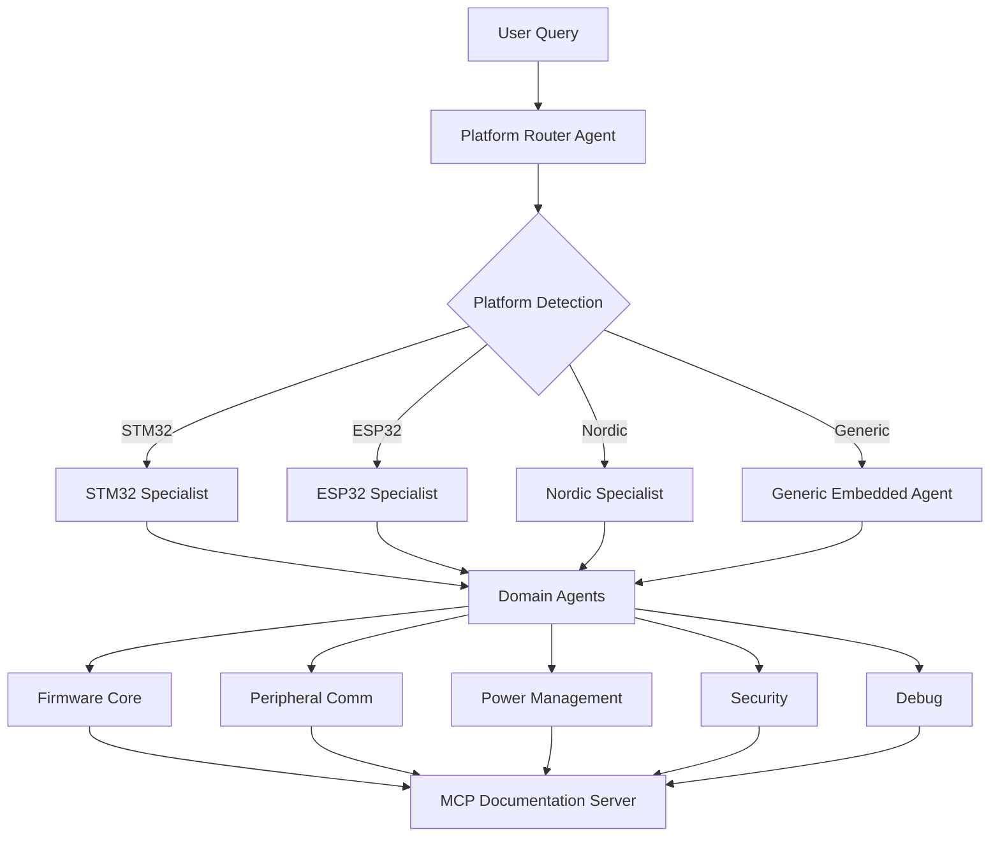

# Embedded C Development Template - Adaptation Plan

## Executive Summary

This document outlines a comprehensive plan to adapt the STM32 multi-agent architecture into a reusable template for embedded C development. The goal is to create a flexible, domain-agnostic framework that can be customized for various microcontroller platforms (STM32, ESP32, Nordic, etc.) while maintaining the powerful agent-based architecture and MCP integration.

---

## 1. Architecture Analysis - STM32 Project

### Key Components Identified

#### 1.1 Multi-Agent System
- **16 specialized agents** organized by domain (firmware, peripherals, security, power, etc.)
- **Triage/Router agent** for intelligent query routing
- **Collaboration protocol** between agents with handoff mechanisms
- **Agent metadata** (triggers, excludes, collaborates_with)

#### 1.2 MCP Server
- **FastMCP-based server** providing documentation search tools
- **ChromaDB vector store** for semantic search
- **15+ specialized tools** (search, lookup, troubleshoot, examples)
- **Auto-ingestion pipeline** for documentation processing
- **Hybrid retrieval** combining semantic + keyword search

#### 1.3 Plugin System
- **Claude Code plugin** with single-command installation
- **Agent auto-registration** from markdown files
- **Slash commands** for quick access
- **MCP server auto-configuration**

#### 1.4 Documentation Pipeline
- **Markdown-based documentation** (80 STM32 documents)
- **Intelligent chunking** with context preservation
- **Metadata extraction** (peripheral, doc type, family)
- **BM25 + vector hybrid search**

### Architecture Strengths
✅ **Modular design** - Easy to add/remove agents
✅ **Clear separation of concerns** - Each agent has specific domain
✅ **Scalable** - Can handle complex multi-domain queries
✅ **Documentation-driven** - Agents backed by searchable knowledge base
✅ **Portable** - No hardcoded paths, works across systems

---

## 2. Embedded C Template Architecture

### 2.1 Core Design Principles



### 2.2 Template Structure

```
embedded-c-template/
├── .claude-plugin/
│   └── plugin.json                 # Plugin manifest (customizable)
├── agents/
│   ├── platform-router.md          # Routes to platform-specific agents
│   ├── generic/                    # Platform-agnostic agents
│   │   ├── firmware-core.md
│   │   ├── peripheral-comm.md
│   │   ├── peripheral-analog.md
│   │   ├── power-management.md
│   │   ├── security.md
│   │   ├── debug.md
│   │   └── hardware-design.md
│   └── platforms/                  # Platform-specific agents
│       ├── stm32/
│       │   ├── stm32-hal.md
│       │   └── stm32-ll.md
│       ├── esp32/
│       │   ├── esp-idf.md
│       │   └── esp-rtos.md
│       └── nordic/
│           └── nrf-sdk.md
├── commands/
│   ├── embedded.md                 # Generic embedded command
│   ├── platform-init.md            # Platform initialization
│   ├── hal-lookup.md               # HAL function lookup
│   └── debug-embedded.md           # Debug command
├── modes/
│   └── embedded-dev.md             # Custom embedded development mode
├── skills/
│   ├── peripheral-config.md        # Reusable peripheral config skill
│   ├── interrupt-setup.md          # Interrupt configuration skill
│   ├── dma-setup.md                # DMA configuration skill
│   └── power-optimization.md       # Power optimization skill
├── mcp_server/
│   ├── server.py                   # MCP server implementation
│   ├── config.py                   # Configuration management
│   ├── platform_detector.py        # Auto-detect platform from project
│   ├── doc_ingestion/              # Documentation ingestion pipeline
│   │   ├── chunker.py
│   │   ├── metadata_extractor.py
│   │   └── validator.py
│   └── tools/
│       ├── search.py               # Search tools
│       ├── examples.py             # Code example tools
│       └── platform_tools.py       # Platform-specific tools
├── storage/
│   ├── chroma_store.py             # Vector database
│   ├── bm25_index.py               # Keyword search
│   └── hybrid_retriever.py         # Combined retrieval
├── docs/
│   ├── TEMPLATE_USAGE.md           # How to use this template
│   ├── CUSTOMIZATION_GUIDE.md      # Customization instructions
│   └── PLATFORM_INTEGRATION.md     # Adding new platforms
├── templates/
│   ├── project-init/               # Project initialization templates
│   │   ├── stm32-project/
│   │   ├── esp32-project/
│   │   └── generic-project/
│   └── code-snippets/              # Reusable code snippets
│       ├── peripheral-init/
│       ├── interrupt-handlers/
│       └── power-modes/
├── mcp-config.json                 # MCP server configuration
└── pyproject.toml                  # Python package configuration
```

---

## 3. Skill System Design

### 3.1 What are Skills?

Skills are **reusable, composable capabilities** that agents can invoke to accomplish specific tasks. Unlike agents (which handle broad domains), skills are **focused, atomic operations**.

### 3.2 Skill Categories for Embedded C

#### Category 1: Peripheral Configuration Skills
```markdown
# Skill: UART Configuration
- Input: Baud rate, parity, stop bits, flow control
- Output: Complete UART initialization code
- Platforms: STM32, ESP32, Nordic, Generic
- Dependencies: Clock configuration skill
```

#### Category 2: Interrupt Management Skills
```markdown
# Skill: Interrupt Setup
- Input: Interrupt source, priority, handler name
- Output: NVIC configuration + handler template
- Platforms: All Cortex-M based
- Dependencies: None
```

#### Category 3: DMA Configuration Skills
```markdown
# Skill: DMA Stream Setup
- Input: Source, destination, transfer size, mode
- Output: DMA configuration code
- Platforms: STM32, Nordic
- Dependencies: Peripheral configuration
```

#### Category 4: Power Management Skills
```markdown
# Skill: Low Power Mode Entry
- Input: Target mode (sleep/stop/standby), wake source
- Output: Power mode configuration + wake logic
- Platforms: All
- Dependencies: Clock configuration, peripheral state
```

#### Category 5: Debug & Diagnostics Skills
```markdown
# Skill: Fault Handler Setup
- Input: Fault type (HardFault, MemManage, etc.)
- Output: Comprehensive fault handler with diagnostics
- Platforms: All Cortex-M
- Dependencies: None
```

### 3.3 Skill Implementation Format

```markdown
---
name: uart-config
category: peripheral-configuration
platforms: [stm32, esp32, nordic, generic]
dependencies: [clock-config]
complexity: medium
---

# UART Configuration Skill

## Description
Generates complete UART initialization code for specified platform.

## Inputs
- `platform`: Target platform (stm32, esp32, nordic, generic)
- `baud_rate`: Desired baud rate (e.g., 115200)
- `parity`: Parity setting (none, even, odd)
- `stop_bits`: Stop bits (1, 1.5, 2)
- `flow_control`: Flow control (none, rts, cts, rts_cts)
- `uart_instance`: UART peripheral instance (e.g., USART1, UART0)

## Outputs
- Complete initialization code
- Clock configuration requirements
- Pin configuration
- Interrupt setup (if needed)

## Platform-Specific Implementations

### STM32 (HAL)
```c
// Generated code for STM32 HAL
UART_HandleTypeDef huart1;

void MX_USART1_UART_Init(void) {
    huart1.Instance = USART1;
    huart1.Init.BaudRate = {{baud_rate}};
    // ... configuration
}
```

### ESP32 (ESP-IDF)
```c
// Generated code for ESP32
uart_config_t uart_config = {
    .baud_rate = {{baud_rate}},
    // ... configuration
};
```

## Validation
- Checks if baud rate is achievable with current clock
- Validates pin availability
- Warns about DMA conflicts

## Related Skills
- clock-config: For clock tree setup
- dma-setup: For DMA-based UART
- interrupt-setup: For interrupt-driven UART
```

---

## 4. Agent Specifications for Embedded C

### 4.1 Platform Router Agent

```markdown
---
name: platform-router
description: Intelligent router that detects platform and routes to appropriate specialist
tools: Read, Grep, Glob, mcp__embedded-docs__detect_platform
---

# Platform Router Agent

## Responsibilities
1. Analyze project structure to detect platform
2. Route queries to platform-specific agents
3. Coordinate multi-platform projects
4. Provide platform-agnostic guidance when appropriate

## Detection Strategy
- Check for platform-specific files (stm32*.h, esp_*.h, nrf*.h)
- Analyze build system (CMakeLists.txt, Makefile, platformio.ini)
- Parse configuration files
- Ask user if ambiguous

## Routing Rules
| Detected Platform | Primary Agent | Fallback |
|-------------------|---------------|----------|
| STM32 | stm32-specialist | generic-embedded |
| ESP32 | esp32-specialist | generic-embedded |
| Nordic | nordic-specialist | generic-embedded |
| Unknown | generic-embedded | - |
```

### 4.2 Generic Embedded Agents

#### Firmware Core Agent
```markdown
---
name: firmware-core
description: Core embedded firmware concepts (interrupts, timers, memory, RTOS)
platforms: all
tools: Read, Edit, Bash, mcp__embedded-docs__search_docs
---

# Firmware Core Agent

## Expertise
- Interrupt management (NVIC, priorities, handlers)
- Timer configuration (PWM, capture, compare)
- Memory management (stack, heap, linker scripts)
- RTOS integration (FreeRTOS, Zephyr)
- Boot process and startup code

## Platform Adaptations
- Uses platform-specific APIs when available
- Falls back to CMSIS for Cortex-M platforms
- Provides generic C patterns for non-ARM platforms
```

#### Peripheral Communication Agent
```markdown
---
name: peripheral-comm
description: Communication peripherals (UART, SPI, I2C, CAN, USB, Ethernet)
platforms: all
collaborates_with: [firmware-core, dma-specialist]
---

# Peripheral Communication Agent

## Expertise
- UART/USART configuration and protocols
- SPI master/slave modes
- I2C master/slave with multi-master support
- CAN bus configuration
- USB device/host
- Ethernet MAC/PHY

## Skills Used
- uart-config
- spi-config
- i2c-config
- dma-setup (for high-speed transfers)
```

### 4.3 Platform-Specific Agents

#### STM32 Specialist
```markdown
---
name: stm32-specialist
description: STM32-specific HAL/LL, CubeMX, clock trees
extends: generic-embedded
tools: mcp__stm32-docs__*, Read, Edit, Bash
---

# STM32 Specialist Agent

## Additional Expertise
- STM32 HAL/LL driver usage
- CubeMX project integration
- STM32-specific clock trees
- STM32 bootloader and DFU
- STM32-specific peripherals (LTDC, DCMI, etc.)

## Delegates to Generic When
- Question is platform-agnostic
- Generic solution is better
- User wants portable code
```

---

## 5. MCP Server Design for Embedded C

### 5.1 Server Architecture

```python
# mcp_server/server.py

class EmbeddedDocServer:
    """
    MCP server for embedded C documentation.
    Supports multiple platforms with unified interface.
    """
    
    def __init__(self):
        self.platform_stores = {
            'stm32': STM32ChromaStore(),
            'esp32': ESP32ChromaStore(),
            'nordic': NordicChromaStore(),
            'generic': GenericEmbeddedStore()
        }
        self.platform_detector = PlatformDetector()
    
    async def search_docs(self, query: str, platform: str = None):
        """
        Search documentation across platforms.
        Auto-detects platform if not specified.
        """
        if not platform:
            platform = await self.platform_detector.detect()
        
        store = self.platform_stores.get(platform, self.platform_stores['generic'])
        return await store.search(query)
```

### 5.2 MCP Tools for Embedded C

| Tool | Description | Platforms |
|------|-------------|-----------|
| `search_embedded_docs` | Semantic search across all docs | All |
| `get_peripheral_docs` | Peripheral-specific documentation | All |
| `get_code_example` | Find code examples | All |
| `lookup_api_function` | API function documentation | Platform-specific |
| `troubleshoot_issue` | Debug common issues | All |
| `get_init_template` | Initialization code templates | All |
| `compare_platforms` | Compare platform features | Multi-platform |
| `detect_platform` | Auto-detect project platform | All |
| `get_skill_code` | Generate code using skills | All |

### 5.3 Documentation Ingestion Strategy

```python
# mcp_server/doc_ingestion/ingestion_pipeline.py

class DocumentIngestionPipeline:
    """
    Flexible pipeline for ingesting embedded documentation.
    Supports multiple formats and platforms.
    """
    
    def ingest_platform_docs(self, platform: str, doc_path: Path):
        """
        Ingest documentation for a specific platform.
        
        Supported formats:
        - Markdown (.md)
        - PDF (datasheets, reference manuals)
        - HTML (online documentation)
        - Header files (.h) with doxygen comments
        """
        pass
    
    def extract_metadata(self, doc: Document) -> Metadata:
        """
        Extract metadata from document:
        - Platform (stm32, esp32, nordic, etc.)
        - Peripheral type (uart, spi, i2c, etc.)
        - Document type (reference, datasheet, app note)
        - API functions mentioned
        - Code examples present
        """
        pass
```

---

## 6. Custom Mode: Embedded Development Mode

### 6.1 Mode Specification

```markdown
---
name: embedded-dev
description: Specialized mode for embedded C development with platform awareness
file_patterns: ["*.c", "*.h", "*.ld", "CMakeLists.txt", "Makefile", "*.cfg"]
---

# Embedded Development Mode

## Purpose
Optimized for embedded C development with:
- Platform-aware code generation
- Hardware-specific optimizations
- Real-time constraints consideration
- Memory-efficient implementations

## Capabilities
1. **Platform Detection**: Auto-detect target platform from project
2. **Code Generation**: Generate platform-optimized code
3. **Peripheral Configuration**: Configure peripherals using skills
4. **Debug Support**: Analyze crashes, memory issues, timing problems
5. **Optimization**: Suggest performance and memory optimizations

## Workflow
1. Detect platform from project structure
2. Load platform-specific agents and skills
3. Access platform documentation via MCP
4. Generate code using appropriate APIs
5. Validate against platform constraints

## Tools Available
- All standard Bob tools (Read, Edit, Bash, etc.)
- MCP embedded documentation tools
- Platform-specific build tools
- Debug tools (GDB, OpenOCD, etc.)

## Restrictions
- Can only edit embedded-related files
- Must consider real-time constraints
- Must validate memory usage
- Must check for platform compatibility
```

### 6.2 Mode Integration with Bob

```markdown
# Integration Points

## 1. Mode Registration
- Add to `.bob/modes/embedded-dev.md`
- Register with Bob's mode system
- Configure file pattern restrictions

## 2. Agent Integration
- Agents accessible via mode
- Can invoke skills from mode
- MCP tools available in mode

## 3. Workflow Example
User: "Create a new STM32 project with UART and I2C"

Mode Actions:
1. Detect: STM32 platform
2. Invoke: platform-router agent
3. Route to: stm32-specialist agent
4. Use skills: uart-config, i2c-config
5. Generate: Complete project structure
6. Validate: Build configuration
```

---

## 7. Implementation Roadmap

### Phase 1: Foundation (Week 1-2)
- [ ] Create template directory structure
- [ ] Implement platform router agent
- [ ] Create generic embedded agents (firmware-core, peripheral-comm)
- [ ] Set up basic MCP server structure
- [ ] Implement platform detection logic

### Phase 2: Skills System (Week 3-4)
- [ ] Define skill specification format
- [ ] Implement core skills (UART, SPI, I2C, interrupt, DMA)
- [ ] Create skill invocation mechanism
- [ ] Add skill validation and testing
- [ ] Document skill creation process

### Phase 3: Platform Support (Week 5-6)
- [ ] Add STM32 platform support (reuse existing)
- [ ] Add ESP32 platform support
- [ ] Add Nordic nRF platform support
- [ ] Create generic fallback implementations
- [ ] Test cross-platform compatibility

### Phase 4: Documentation & MCP (Week 7-8)
- [ ] Set up documentation ingestion pipeline
- [ ] Ingest STM32 documentation (reuse existing)
- [ ] Ingest ESP32 documentation
- [ ] Ingest Nordic documentation
- [ ] Implement all MCP tools
- [ ] Test documentation search quality

### Phase 5: Custom Mode (Week 9-10)
- [ ] Create embedded-dev mode specification
- [ ] Integrate with Bob's mode system
- [ ] Add mode-specific tools and restrictions
- [ ] Test mode workflows
- [ ] Document mode usage

### Phase 6: Testing & Documentation (Week 11-12)
- [ ] Comprehensive testing across platforms
- [ ] Create usage examples
- [ ] Write customization guide
- [ ] Create video tutorials
- [ ] Prepare for release

---

## 8. Customization Guide for Users

### 8.1 Adding a New Platform

```bash
# Step 1: Create platform directory
mkdir -p agents/platforms/my-platform

# Step 2: Create platform specialist agent
cat > agents/platforms/my-platform/my-platform-specialist.md << 'EOF'
---
name: my-platform-specialist
description: Specialist for MyPlatform microcontrollers
extends: generic-embedded
---
# MyPlatform Specialist Agent
...
EOF

# Step 3: Add platform to router
# Edit agents/platform-router.md to include new platform

# Step 4: Create platform-specific skills
mkdir -p skills/my-platform/

# Step 5: Add documentation
mkdir -p mcp_server/markdowns/my-platform/
# Add your platform's documentation here

# Step 6: Ingest documentation
python scripts/ingest_docs.py --platform my-platform

# Step 7: Test
/embedded "Configure UART on MyPlatform"
```

### 8.2 Creating Custom Skills

```markdown
# Template: skills/my-custom-skill.md

---
name: my-custom-skill
category: peripheral-configuration
platforms: [stm32, esp32]
dependencies: [clock-config]
complexity: medium
---

# My Custom Skill

## Description
[What this skill does]

## Inputs
- `param1`: Description
- `param2`: Description

## Outputs
- Generated code
- Configuration notes

## Implementation
[Platform-specific code generation logic]

## Validation
[How to validate the generated code]
```

### 8.3 Customizing Agents

```markdown
# Extend existing agent
---
name: my-custom-agent
extends: firmware-core
additional_tools: [my-custom-tool]
---

# My Custom Agent

## Additional Expertise
[What this agent adds beyond the base agent]

## Custom Workflows
[Specific workflows this agent handles]
```

---

## 9. Integration with Bob's Hackathon Project

### 9.1 Directory Structure in BobsHackathon

```
BobsHackathon/
├── .bob/
│   ├── agents/
│   │   └── embedded/              # Embedded agents
│   │       ├── platform-router.md
│   │       ├── firmware-core.md
│   │       └── ...
│   ├── modes/
│   │   └── embedded-dev.md        # Embedded mode
│   ├── skills/
│   │   └── embedded/              # Embedded skills
│   │       ├── uart-config.md
│   │       └── ...
│   └── commands/
│       └── embedded.md            # Embedded command
├── embedded-mcp-server/           # MCP server for embedded docs
│   ├── mcp_server/
│   ├── storage/
│   └── docs/
└── projects/                      # User projects
    ├── stm32-project/
    ├── esp32-project/
    └── ...
```

### 9.2 Installation Steps

```bash
# 1. Clone template into Bob's project
cd /home/olive/Documents/IBM_BOB/BobsHackathon
git clone <embedded-template-repo> embedded-template

# 2. Install MCP server
cd embedded-template
pip install -e .

# 3. Register MCP server with Bob
claude mcp add embedded-docs --scope user -- python -m mcp_server

# 4. Copy agents to Bob's agent directory
cp -r agents/* .bob/agents/

# 5. Copy modes to Bob's mode directory
cp modes/embedded-dev.md .bob/modes/

# 6. Copy skills to Bob's skill directory
cp -r skills/* .bob/skills/

# 7. Test installation
/embedded "Test embedded system"
```

---

## 10. Key Differentiators from STM32 Project

### What's Different?

1. **Platform Agnostic**: Not tied to STM32, supports multiple platforms
2. **Skill System**: Reusable, composable capabilities beyond agents
3. **Custom Mode**: Dedicated embedded development mode
4. **Template-Based**: Designed to be cloned and customized
5. **Extensible**: Easy to add new platforms, skills, and agents

### What's Reused?

1. **Agent Architecture**: Multi-agent system with routing
2. **MCP Server**: Documentation search infrastructure
3. **Plugin System**: Claude Code integration
4. **Documentation Pipeline**: Ingestion and chunking
5. **Hybrid Search**: Vector + keyword search

---

## 11. Success Metrics

### Technical Metrics
- [ ] Support for 3+ platforms (STM32, ESP32, Nordic)
- [ ] 20+ reusable skills implemented
- [ ] 10+ specialized agents
- [ ] <100ms documentation search response time
- [ ] 95%+ platform detection accuracy

### User Experience Metrics
- [ ] Single-command installation
- [ ] Auto-detection of platform from project
- [ ] Code generation in <5 seconds
- [ ] Accurate documentation retrieval
- [ ] Clear error messages and guidance

### Adoption Metrics
- [ ] 5+ community-contributed platforms
- [ ] 10+ community-contributed skills
- [ ] Active usage in real projects
- [ ] Positive user feedback

---

## 12. Next Steps

### Immediate Actions
1. **Review this plan** with stakeholders
2. **Prioritize features** based on user needs
3. **Set up development environment**
4. **Create GitHub repository** for template
5. **Start Phase 1 implementation**

### Questions to Answer
1. Which platforms should we support first?
2. What skills are most critical?
3. How should we handle platform-specific quirks?
4. What documentation sources are available?
5. How do we test across multiple platforms?

---

## Appendix A: Comparison Matrix

| Feature | STM32 Project | Embedded C Template |
|---------|---------------|---------------------|
| Platform Support | STM32 only | Multi-platform |
| Agent Count | 16 | 10+ generic + platform-specific |
| Skill System | No | Yes |
| Custom Mode | No | Yes (embedded-dev) |
| Documentation | STM32 docs | Multi-platform docs |
| Extensibility | Medium | High |
| Use Case | STM32 development | General embedded C |

## Appendix B: Technology Stack

- **Language**: Python 3.11+
- **MCP Framework**: FastMCP
- **Vector DB**: ChromaDB
- **Embeddings**: Sentence Transformers
- **Search**: BM25 + Vector Hybrid
- **Documentation**: Markdown + PDF
- **Build Tools**: CMake, Make, PlatformIO
- **Debug Tools**: GDB, OpenOCD, J-Link

## Appendix C: Resources

- [MCP Protocol Specification](https://modelcontextprotocol.io/)
- [FastMCP Documentation](https://github.com/jlowin/fastmcp)
- [ChromaDB Documentation](https://www.trychroma.com/)
- [STM32 Reference Project](https://github.com/creativec09/stm32)
- [Embedded C Best Practices](https://barrgroup.com/embedded-systems/books/embedded-c-coding-standard)

---

**Document Version**: 1.0  
**Last Updated**: 2026-05-02  
**Author**: Bob (Plan Mode)  
**Status**: Ready for Review